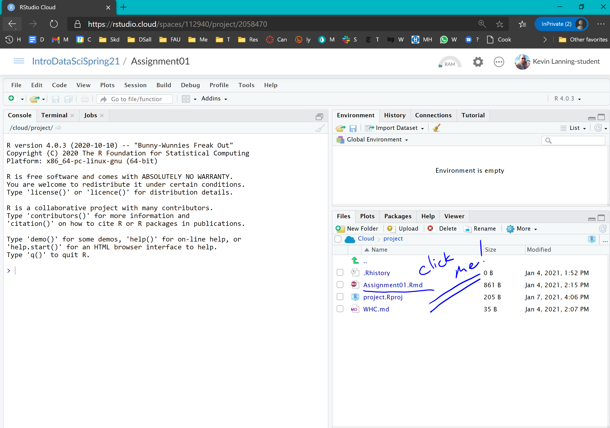

# welcome to R world

In this chapter, we'll learn how to install and use R in two ways - in the cloud and on your own laptop. For each of these, we'll use RStudio as a front end (an 'integrated development environment', or IDE).

## Using RStudio cloud

Using the link provided to you by your instructor, set up a new account in RStudio (it is free for you). Then click on the Join Space button. It will bring you to the Welcome page. (Not much to see here as yet). Click on the [hamburger menu](https://en.wikipedia.org/wiki/Hamburger_button). You should see, on the left side of the screen, a menu with three sections: Spaces, Learn, and Help.

The **Spaces** menu will likely include three options. The first will be "Your Workspace," the second will be the workspace for this class (e.g., IntroDataSciSpring21), and the third will allow you to create a "New Space."

Click on the class workspace, then on the first assignment. After a few seconds, you'll see a screen that looks something like the following:

**Click on the assignment**, and you'll see that there are now four windows on the screen (note that these windows are fully customizable, so that the locations and characterizations I am giving here are just a starting point):

In the upper left is the **source** window - the code you are working on.. This is where we will be doing much of our work, typically in R markdown documents like this one. R markdown is, not surprisingly, a 'flavor' of markdown. Other tabs in this quadrant may include displays of your data and other scripts that you may be working on.

The **console**, by default in the lower left quadrant, can be used to execute single lines of code. You may occasionally use the terminal tab here as well.

The **environment**, in the upper right, includes datasets, variables, and functions that are available to us. The Build and Git tabs are useful for producing documents and version control/collaboration, respectively. The history tab is useful to go back and look at the syntax you used in a prior chunk of code.

The **files** in our directory are listed in the lower right; additional tabs include a list of available packages (libraries) and some resources for help.

Now read the code in the console, and follow the instructions to complete your first homework assignment. Congratulations, you've just run your first code in R.

## Using R Studio on your laptop

Install the latest version of [R](https://www.r-project.org/) on your own Windows or Mac laptop. Then install the [preview version of R studio](https://rstudio.com/products/rstudio/download/preview/), as this has a visual (WYSIWYG) editor that is a significant advance over the existing version.

**Feeling ambitious?** Once this is loaded, (a) set up a directory for this class, then (b) a subdirectory you can call Assignment01.

Go back to your Rstudio.cloud / Assignment01, and check the boxes next to Assiignment01.Rmd, movies.Rdata, and project.rproj. Then click on 'More', then 'Export...' and put these in your new subdirectory.

Now go back to your desktop environment, and try to run the same code on your home machine. (Note that to be successful, you will need to first execute the command on your laptop).

> install.packages("tidyverse")

------------------------------------------------------------------------

Get as far as you can, but remember the 15 minute rule. How far did you get? Be prepared to share your frustrations, discoveries, and accomplishments with your classmates.
