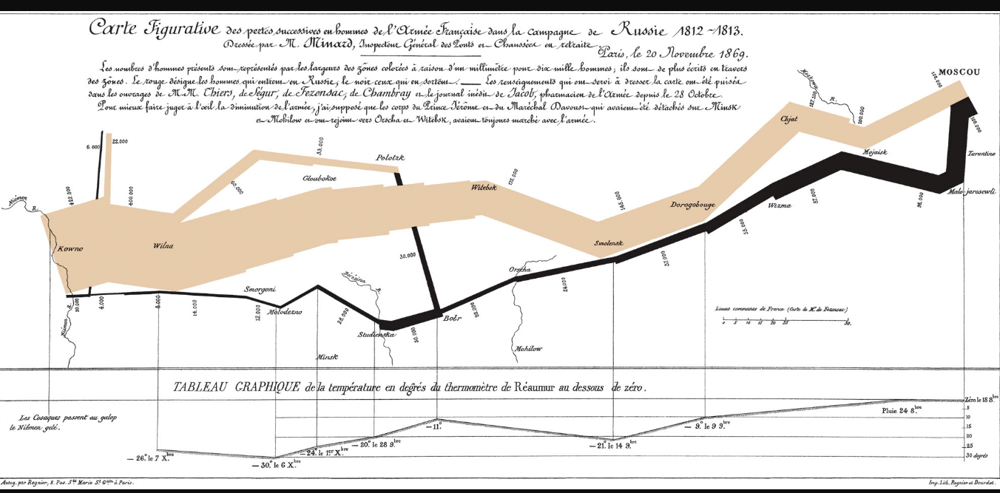
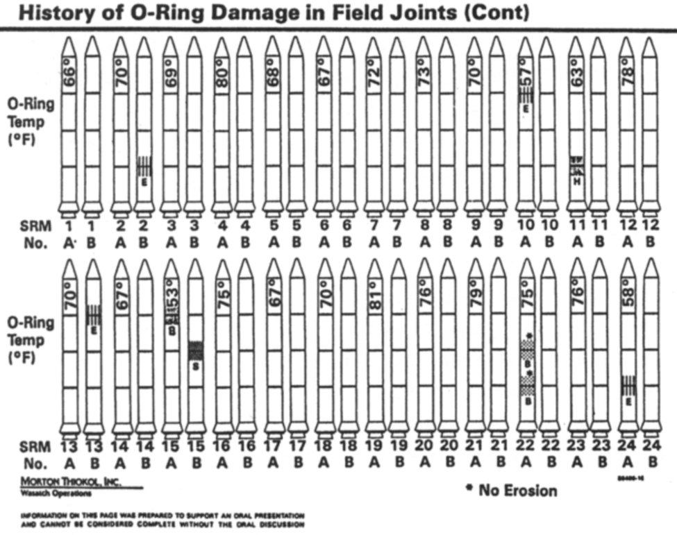

# (PART) Part II Towards data literacy {.unnumbered}

# principles of data visualization

## some opening thoughts

Graphs aren't just to inform, but to make you reflect.

We are concerned not just with the design of graphs, but with our role in society as leaders, as arbiters of facts, as educators. We want to foster data literacy.

How do people understand graphs? How can you use graphs to tell people the truth in a way that they understand? How can you convey uncertainty in a graph?

When you see a graph, what do you notice, what do you wonder, and what is the story? Is "story telling" what visualizations should be about?

A graph might begin with perception and understanding (the consumer), with knowledge and design values (the producer), but it also reflects the truth of the data. How much is each?

## some early graphs

Visual displays of information reach back to prehistoric times; modern graphs date back, arguably, to [Playfair's 1786 Political Atlas](https://robots.thoughtbot.com/analyzing-minards-visualization-of-napoleons-1812-march) - in which

> "... spatial dimensions were used to represent nonspatial, quantitative, idiographic, empirical data. Although it now seems natural to represent, for example, rising and falling imports over time as a rising and falling line, it does not seem to have been done before that time and was quite an accomplishment. Notably, in addition to the statistical line chart, Playfair at one fell swoop single-handedly invented most of the remaining forms of the statistical graphic repertoire used today-the bar chart and histogram, the surface chart, and the circle diagram or "pie chart" [@wainer1981].

------------------------------------------------------------------------

The most celebrated early graph is that of [Minard](https://datavizblog.com/2013/05/30/dataviz-history-charles-minards-flow-map-of-napoleons-russian-campaign-of-1812-polotsk-smolensk-and-on-to-borodino/):

The visualization depicts the size, latitude, and longitude of Napoleon's army as they moved towards (tan line) then away (black line) from Moscow; temperature during the retreat is plotted as well. Further, vertical lines linking the temperature display to the number of troops indicate the often perilous river crossings which further decimated Napoleon's troops). [Cheng (2014)](https://robots.thoughtbot.com/analyzing-minards-visualization-of-napoleons-1812-march) decomposes the graph and provides some simpler visualizations; she also provides the following background:

> "*Czar Alexander of Russia sees that Napoleon was becoming too powerful, so he refuses to participate in this embargo [against the UK]. Angry at Czar Alexander's decision, Napoleon gathers a massive army of over 400,000 to attack Russia in June of 1812. While Russia's troops are not as numerous as France's, Russia has a plan. Russian troops keep retreating as Napoleon's troops move forward, burning everything they pass, ensuring that the French forces could not take anything from their environment. Eventually the French army follows the Russian army all the way to Moscow during October, suffering major losses from lack of food. By the time Napoleon gets to Moscow, he knows he has to retreat. As winter settles into Europe and the temperature drops, Napoleon's troops suffer even more losses, returning to France from lack of food, disease, and weather conditions."*

Of course, the casualties and retreat of Napoleon's army are immortalized not just in this graph, but also in Russian literature (Tolstoy's *War and Peace*) and music (Tchaikovsky's 1812 overture, in which five cannon shots mark the battle of Borodino and eleven more mark the arrival of Napoleon in the now-razed city of Moscow).

## Tukey and EDA

For [@donoho2017], the publication of John Tukey's "Future of Data Analysis" [@tukey1962] arguably marks the beginning of data science. As the first data scientist, Tukey embraced a descriptive and exploratory approach to data analysis, particularly in his publication of *Exploratory Data Analysis* [@tukey1977].

In EDA, Tukey presented an idiosyncratic, coherent approach to looking at data, beginning with tallying. The distributions of small counts of single variables, for Tukey, could best be presented in **stem and leaf displays.** Comparisons between groups can be presented in **box plots.** To examine relationships between variables and the adequacy of simple models, he argues for thoughtfully transforming data to uncover linear trends, then to examine **residuals** to find where these trends do not hold.

## approaches to graphs

A graph might begin with perception and understanding (the consumer), with knowledge and design values (the producer), but it also reflects the truth of the data. How much is each?

In thinking about how to design graphs, we can begin with abstract theory, with principles of design informed by our understanding of perception, or with empirical analyses of understanding and memory.

## Tufte: first principles

[@tufte2001] describes **Graphical Excellence**. Graphs should, among other things, "Induce the viewer to think about the substance, rather than about methodology, graphic design, the technology of graphic productions, or something else." Graphs should "Present many numbers in a small space, make large data sets coherent, and encourage the eye to compare different pieces of data." Graphs should "serve a reasonably clear purpose: description, exploration, tabulation, or decoration [and] be closely integrated with the statistical and verbal descriptions of a data set." Tufte concludes with the following Principles of Graphical Excellence, which I quote verbatim:

-   Graphical excellence is the well-designed presentation of interesting data---a matter of substance, of statistics, and of design.
-   Graphical excellence consists of complex ideas communicated with clarity, precision and efficiency.
-   Graphical excellence is that which gives to the viewer the greatest number of ideas in the shortest time with the least ink in the smallest space.
-   Graphical excellence is nearly always multivariate.
-   And graphical excellence requires telling the truth.

## the politics of data visualization

On a cold morning in January, 1986, Space Shuttle Challenger lifted off from Cape Canaveral. Because of the cold weather, engineers at Morton Thiokol, who designed the rocket boosters, considered the possibility that the O-rings which sealed joints on the rockets would be too hard and brittle to prevent the release of potentially explosive fuel. They examined the relation between temperature and o-ring damage on prior flights, using the following visualization:

What, if anything, can we see here? The graphic was chaotic and poorly designed; if the engineers had wanted to systematically explore the relation between o-ring damage and temperature they could have removed the rockets and arranged them on a single axis by liftoff-temperature rather on several rows by liftoff-date. Here's what they would have seen:

The forecast for the morning of the launch was far colder than that for prior launches, and within the set of prior launches a clear relationship between temperature and o-ring damage is evident. But the Challenger did launch, exploding shortly after takeoff, killing the seven astronauts on board. With a clearer display of the data, the Challenger launch would likely have been postponed [@tufte2001].

### poor design leads to an uninformed or misinformed world

In the flood of information that surrounds us, our peripheral and sometimes our focal attention will be drawn to pictorial summaries of consequential events and effects. But while data visualizations and data journalism has become more responsible, poorly designed graphs - what Tufte has described as "chartjunk" - are still common. Consider the following graph, which recently appeared in a number of newspapers or feeds in the United States (including the *Palm Beach Post,* on January 12, 2019).

> **Exercise 6.1** *Examine the graph shown above.*
>
> *Look at it for just a moment, as if you might while reading something else on the screen, or as your ten-year old little sister might. What does the graph tell you?*
>
> *Look at it more closely. What does it actually say? How could you improve it to make the content of the graph more informative about its title?*
>
> *Why was the graph designed in this way?*
>
> *Does this matter?*

Poorly designed graphs don't just confuse rocket scientists. They reach us, mislead us, and make fools of all of us as well. With better graphs, we become a better informed, better educated citizenry.

### poor design can be a tool to deceive

).*](images/trumpDorian.jpg)

The apps on our smartphones and electronic devices are meticulously designed to maintain our attention. They are largely successful, but, for many of us, made it more difficult to read in depth (Wu, *The Attention Merchants*). With information all around us demanding our attention, visual representations of data have become particularly important. The data visualization is, increasingly, not just a supplement to the story, but the story itself. When this premise is coupled with the idea that the truth is malleable, the product of what our leaders say rather than empirical statements of fact, we approach a dangerous situation, one in which real threats are misrepresented and lives are again endangered.

Presenting information in self-promoting ways includes so-called "Sharpie-gate," where President Trump simply altered a hurricane prediction map in defense of a misstatement. It also includes more subtle misrepresentations: Does stand-your-ground really make us safer?

## the psychology of data visualization

Speaking of America, consider the following:

In this figure, from [@wainer1981], (Chernoff's) faces are used to represent multivariate data. The display is loosely based on the (psychological) premise that, from infancy, we are inordinately sensitive to facial features. Consequently, the most powerful, effective, or informative data displays should manipulate facial features. Does this graph succeed? Why or why not? Would an updated model, based on richer, more complex, and more realistic simulations of facial expressions [@thies2015] be more successful?

### the power of animation

Animated data displays bring the dimension of time into data visualization. Here are two brief (\< 5 minutes) animated data displays, each powerful in its own way, and each of which gives the viewer an appreciation of an important social phenomenon.

The first is from the late Hans Rosling, and summarizes a chunk of the Gapminder data. There is a Gapminder package in R if you would like to explore the data further, and perhaps become the next Rosling:

*Video 6.9: Rosling and social progress*

The second is from Kim Rees and her ex-colleagues at [Periscopic](https://periscopic.com/) (Rees is now at CapitalOne). For me, it's an important graphic because it tries to overcome what has been called "psychic numbing" - we are sensitive to the individual case, but lose our perspective when faced with large-scale tragedies, so that effectively the more lives lost... the less we care [@slovic2013].

*Video 6.10: Rees and stolen years*

### telling the truth when the truth is unclear

We live in an uncertain world, and a major challenge in data visualization is how to convey this uncertainty in a way that people understand readily. Examples of this are familiar. Here in Florida, projected hurricane paths are frequently represented by a "cone of uncertainty" surrounding a single track. An alternative approach is to use a display which shows a distribution of possible tracks.

### visualizing uncertainty

To further illustrate the idea of uncertainty, data visualizations may be animated. To display hurricane outcomes, for example, individual lines in a spaghetti plot might fade in and out [@cox2013a]. Another use of animation is suggested by [@hullman2015] who use [hypothetical outcome plots](https://cdn-images-1.medium.com/max/600/1*vol7-537cqnpucRgBP-j9A.gif) rather than simple error bars to illustrate sampling distributions. Empirically, subjects have a better understanding of the meaning of statistical effects when these are represented by dynamic displays.

During the 2016 US Presidential Election, the NY Times graphics presented the range of likely possibilities (here, between the 25th and 75th percentiles) as a dynamically changing ["jittery gauge"](https://www.vis4.net/blog/images/old/jitter4.gif) . Following the election, there was some criticism of these gauges, as readers claimed that they tended to make them anxious. However, it appears that at least some of the anxiety was attributable not to the gauges themselves, but to the [electoral outcome itself](https://www.vis4.net/blog/2016/11/jittery-gauges-election-forecast/). The gauges were back in 2018, and will likely be used again in the future.

Finally, animation may be used not just to display uncertainty or a possible range, but also data displays which both carry a great deal of information and unfold over time, such as [the language of personality development](http://wise.fau.edu/~lanning/EgoDevelopmentsmallest.gif) in my own work.

## further reading and resources

If you'd like to learn more, [@tufte2001] and his other books are beautiful and thought provoking. [@cleveland1985] examines graphs from a more rigorous psychological and empirical viewpoint. The Data Stories podcasts are often excellent, despite the challenge of an auditory medium for visual display ([especially the episode on Hans Rosling](http://datastori.es/92-a-tribute-to-hans-rosling/)). And [@healy2018] provides a comprehensive introduction that, in essence, provides the basis for a semester-long course based in the ggplot2 package in R that we will be working with in the next chapter [@wickham2016].

Finally, several years ago Alberto Cairo of the University of Miami offered an online MOOC (massive open online course) on data visualizations. You can find the course materials [here](https://journalismcourses.org/course/data-visualization-for-storytelling-and-discovery/).
