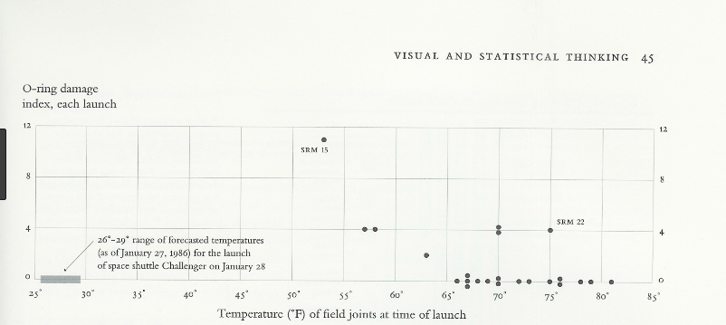
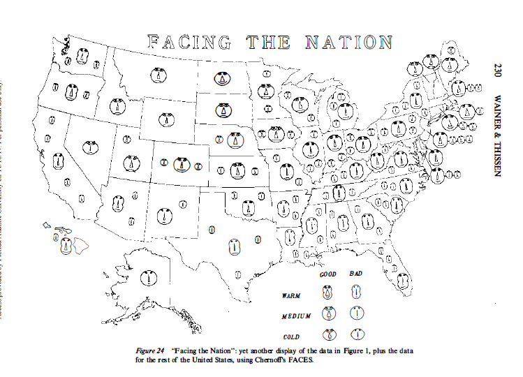
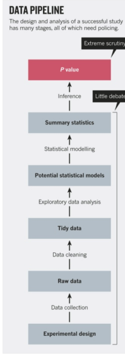

#  {-} 

<!--chapter:end:index.Rmd-->

---
title: "00-invitation"
author: "Kevin Lanning"
date: "`r Sys.Date()`"
output:
  pdf_document: default
  html_document: default
---

# preface {-}

## status 95% {-}

Revisit links to other colleges. Include list of needed resources (computer, r server, packages, etc.) for instructor and student.

--------


This work-in-progress will ultimately serve as a textbook for introductory undergraduate courses in data sciences.  No prior knowledge of computer programming is presumed, though, ideally, students will have had college algebra (or its equivalent) and an introductory course in statistics, methods, or data analysis.

Data science is still a new field of study, and there are multiple approaches to teaching it and to its place in the college curriculum. This book is intended to serve courses such as the [*_Introduction to Data Science_*](https://kevinlanning.github.io/DataSciSpring2019/) at the Wilkes Honors College of Florida Atlantic University which, in turn, draws from data science classes at the universities of [North Carolina](https://idc9.github.io/stor390/), [British Columbia](https://github.com/STAT545-UBC/STAT545-UBC.github.io), [Duke](https://www2.stat.duke.edu/courses/Fall15/sta112.01/), [Maryland](http://www.hcbravo.org/IntroDataSci/calendar/), [Wisconsin](http://pages.stat.wisc.edu/~yandell/R_for_data_sciences/syllabus.html), [Stanford](https://github.com/dcl-2017-04/curriculum), [BYU](https://byuistats.github.io/M335/syllabus.html), [Harvard](http://datasciencelabs.github.io/), [Pennsylvania](https://github.com/MUSA-620-Spring-2017/Course-Materials), and [UC Berkeley](https://github.com/FAUDataScience/stat259) At each of these schools, the Introduction to Data Science appears, to my eyes at least, closer to Statistics than to Computer Science. 

But if our approach is closer to statistics than to programming, it is particularly close to statistics in its most applied and pragmatic form. The choice of statistical methods should follow from the data and problem at hand - or, as @loevinger1957objective once put it, statistics should be the handmaiden of real-world concerns rather than technology.

This pragmatic focus is driving the growth of data science in industry, and it is reflected in the way data science is taught at still other schools including [Chicago](https://github.com/UC-MACSS/persp-analysis), [Georgia Tech](https://github.com/jacobeisenstein/gt-css-class), [UC Santa Barbara](https://github.com/raviolli77/dataScience-UCSBProjectGroup-Syllabus), [Princeton](http://www.princeton.edu/~mjs3/soc596_f2016/), [UC Berkeley](https://github.com/rochelleterman/PS239T), at [Berlin's Hertie School of Governance](https://github.com/HertieDataScience/SyllabusAndLectures), and in [Columbia's School of Journalism](https://github.com/tommeagher/data1-fall2015).

## some features of the text {-}

There are a number of different approaches to teaching data science.  The present text includes several distinguishing features. 

**R**

In my 2017 survey of introductory data science courses, I saw a pretty even split between those which begin with Python and those which begin with the statistical programming language R. This difference corresponds, loosely, to the split noted above: Computer science based approaches to data science are frequently grounded in Python, while statistics-based approaches are generally grounded in R. Our course, like those for most of the syllabi and courses linked above, will be based in R. 

**Reproducible science**

The course will provide an introduction to some of the methods and tools of reproducible science. We will consider the replication crisis in the natural and social sciences, and then consider three distinct approaches which serve as partial solutions to the crisis.  The first of these is training in a notebook-based approach to writing analyses, reports and projects (using R markdown documents). The second is using public repositories (such as the [Open Science Framework](https://osf.io/) and [GitHub](https://github.com/)) to provide snapshots of projects over time. Finally, the third is to consider the place of significance testing in the age of Big Data, and to provide training in the use of descriptive, exploratory techniques of data analysis.

**Good visualizations**

Part of Type C data science is communication, and this includes not just writing up results, but also designing data displays that incisively convey the key ideas or features in a flood of data. We'll examine and develop data visualizations such as plots, networks and text clouds. More advanced topics may include maps, interactive displays, and animations.

**~~All~~ *Some of* the data**

It's been [argued](https://www.udemy.com/datascience/learn/v4/t/lecture/3473822?start=379) that in the last dozen years, humans have produced more than 60 times as much information as existed in the entire previous history of humankind. (It sounds like hyperbole, but even if it's off by an order of magnitude it's still amazing).  There are plenty of data sources for us to examine, and we'll consider existing datasets from disciplines ranging from literature to economics to public health, with sizes ranging from a few dozen to millions of data points.  We will also clean and create new datasets.

**~~All~~ *Some of* the tools**

In addition to R, we'll use a range of other tools: We'll communicate on the Slack platform. We'll write using markdown editors such as [Typora](https://typora.io/). We'll certainly use spreadsheets such as Excel or Google Sheets. We *may* use additional tools for visualizing data such as Gephi and Tableau.  In any event, **there will be computing throughout the course.** You will be expected to bring a laptop every day. (Please let Dr. Lanning know ASAP if you don't have access to this).

**The place of data science in the college curriculum**

At this writing, there is enthusiasm across units of FAU and its affiliated institutes, including Max Planck and FAU's Colleges of Science and Engineering as well as the WHC, for integrating data science into our curriculum. Within the WHC, a data science minor and a multi-track concentration are under development.  Until these proposals have been formally approved, students interested in concentrating in Data Science are encouraged to pursue an individual concentration (see Dr. Lanning for details). 

In addition, there are several integrated '4 + 1' pathways which will lead to a master's degree in the College of Engineering. These programs are also in progress; again, see Dr. Lanning for additional details.   

## the book is for you {-}

It's my intention that this text should serve every college student, regardless of concentration or college major. The skills and insights that you will gain in this course will help you in graduate and professional schools, will help you in your careers, and will help you in your goal of making a better world. And it will help you train the next generation of data scientists as well.

We invite you to join our discussion in our Slack group at https://join.slack.com/t/datascilibaarts/shared_invite/enQtNjE4NDM2Nzk1NzQ2LTllZjdjNTY0MDFmZTc0ZDRhZGEwMDYzZDQxNGJlZmJkZjFkZWExOGY5YTZjMGQyNmUxMTM1ZTEyYWM5ZDQ3M2U.

<!--chapter:end:00-Preface.Rmd-->

---
title: "01-DataSci"
author: "Kevin Lanning"
date: "`r Sys.Date()`"
output:
  pdf_document: default
  html_document: default
---
# (PART) Introduction {-}
# data science for the liberal arts

## status 90%  {-}

Combine features of data science with levels (below). Move last section into next chapter as pretest.  

----------


Hochster, in @hicks2017guide, describes two broad types of data scientists: Type A (Analysis) data scientists, whose skills are like those of an applied **statistician**, and Type B (Building) data scientists, whose skills lie in problem solving or coding, using the skills of the **computer scientist**.  This view arguably omits a critical component of the field, as data science is driven not just by statistics and computer science, but also by "domain expertise:"


## type C data science = data science for the liberal arts

The iconic [Venn diagram model of data science](https://www.google.com/search?q=venn+diagram+model+of+data+science&newwindow=1&safe=active&rlz=1C1CHBF_enUS762US763&tbm=isch&tbo=u&source=univ&sa=X&ved=0ahUKEwiM_abBtY7XAhXDQCYKHdgyB58QsAQIOg&biw=1378) shown above suggests what we will call "Type C data science." It begins with "domain expertise" in your **concentration** in the arts, humanities, social and/or natural sciences, it both informs and can be informed by new methods and tools of data analysis, and it includes such things as **communication** (including writing and the design and display of quantitative data), **collaboration** (making use of the tools of team science), and **citizenship** (serving the public good, overcoming the digital divide, furthering social justice, increasing public health, diminishing human suffering, and making the world a more beautiful place).  It's shaped, too, by an awareness of the fact that the world and workforce are undergoing massive **change**: This puts the classic liberal arts focus of "learning how to learn" (as opposed to memorization) at center stage. And Type C data science is shaped, not least, by the **creepiness** of living increasingly in a measured, observed world.  

Type C data science does not merely integrate 'domain expertise' with statistics and computing, it places content squarely at the center.  We can appreciate the compelling logic and power of statistics as well as the elegance of well-written code, but for the purposes of this book, these are means to an end. Programming and statistics are tools in the service of social and scientific problems and cultural concerns. Type C data science aims for work which is not merely cool, efficient, or elegant but responsible and meaningful.

## the incompleteness of the data science Venn diagram

Data visualizations are starting points which can provide insights, typically highlighting big truths or effects by obscuring other, presumably smaller ones.  The Venn diagram model of data science is no exception: As with other graphs, figures, and maps, it allows us to see by showing only part of the picture. What does it omit?  That is, beyond **statistics**, **computing/hacking**, and **domain expertise**, what other skills contribute to the success of the data scientist?

The complexity of data science is such that individuals typically have expertise in some but not all facets of the area. Consequently, problem solving requires **collaboration**. Collaboration, even more than statistical and technical sophistication, is arguably the most distinctive feature of contemporary scholarship in the natural and social sciences as well as in the private sector [@isaacson2014innovators].

**Communication** is central to data science because results are inconsequential unless they are recognized, understood, and built upon; facets of communication include oral presentations, written texts and, too, clear data visualizations.

**Reproducibility** is related to both communication and collaboration. There has been something of a crisis in recent years in the social and natural sciences as many results initially characterized as "statistically significant" have been found not to replicate.  The reasons for this are multiple and presently contentious, but one path towards better science includes the public sharing of methods and data, ideally before experiments are undertaken.  Reproducible methods are a key feature of contemporary data science. 

**Pragmatism** refers to the relevance of work towards real-world goals.  

Ideally, these pragmatic concerns take into account **ethical concerns** as well.

## a dimension of depth

Cutting across these eight facets (statistics, computing, domain expertise, collaboration, communication, reproducibility, pragmatism, and ethics), a second dimension can be articulated. No one of us can excel in all eight domains, rather, we might aim towards goals ranging from **literacy** (can understand) through **proficiency** (can get by) to **fluency** (can practice) to **leadership** (can create new solutions or methods).  

That is, we can think of a *continuum* of knowledge, skills, interests, and goals, ranging from that which characterizes the data *consumer* to the data *citizen* to the data science *contributor.* A Type C data science includes this dimension of 'depth' as well.

## Google and the liberal arts

Data science is at its core empirical, and all of this rhetoric would be meaningless if not grounded in real world findings.  Although it was reported in late 2017 that [soft skills rather than STEM training were the most important predictors of success among Google employees](https://www.washingtonpost.com/news/answer-sheet/wp/2017/12/20/the-surprising-thing-google-learned-about-its-employees-and-what-it-means-for-todays-students/?sw_bypass=true&utm_term=.23e48235d66e), it's difficult to know whether these results would generalize to a less select group.  Nonetheless, there is a clear need for individuals with well-rounded training in the liberal arts in data science positions and, conversely, learning data science is arguably a key part of a contemporary liberal arts education.

## data sci and TMI

One difference between traditional statistics and data science is that the former is typically concerned with making inferences from datasets that are too *small*, while the latter is concerned with extracting a signal from data that is or are too *big* [@donoho2015fifty]. 

The struggle to extract meaning from a sea of information - of finding needles in haystacks, of finding faint signals in a cacophony of overstimulation - is arguably the question of the age.  It is a question we deal with as individuals on a moment-by-moment basis. It is a challenge I face as I wade through the many things that I could include in this class and these notes.

The *primacy of editing* or selection lies at the essence of human perception and the creation of art forms ranging from novels to film.  And it is a key challenge that the data scientist faces as well.

## discussion: what will you do with data science?

Imagine it is ten years from today. You are working in a cool job (yay). How, ideally, would 'data science' inform your professional contributions?

More proximally (closer to today) - what are your own goals for progress in data science, in terms of the model described above?

<!--chapter:end:01-DataSci.Rmd-->

---
title: "02-Setup"
author: "Kevin Lanning"
date: "`r Sys.Date()`"
output:
  pdf_document: default
  html_document: default
---
# getting started

## status 90%  {-}

Review other introductory chapters cited below and decide whether to include more, drop, etc. Incorporate pretest at <http://bit.ly/IDSquiz1>. Recast result as a Shiny app to represent students current skills and aspirations.

----


We begin with a brief self-assessment, asking you to reflect on your own knowledge of data science, including the necessary-but-not-sufficient areas of computer programming and statistics. We then move to a description of some rudimentary tools that we will be using. 

## are you already a programmer and statistician?

Regarding **programming**, you may know more than you think you do.  Here's a simple program - a set of instructions - for producing a cup of coffee:

>   add water to the kettle and turn it on
>
>   if it's morning, put regular coffee in the French press, otherwise use decaf
>
>   if the water has boiled, add it to the French press, else keep waiting
>
>   if the coffee has steeped for four minutes, depress (smash) piston/plunger, else keep waiting 
>
>   pour coffee into cup
>
>   enjoy

As a post-millennial student from a WEIRD culture (a Western, Educated, Industrialized, Rich Democracy,  @henrich2010weirdest, you've 'programmed' computers, too, if only to enter a password, open an app, and upload a photo on your cell phone. 

**Statistics** is of fundamental importance, not just for understanding abstract trends, but for making decisions about everyday life. Consider the case of Susie, a college senior:

>   **Exercise 2_1** 
>   *Susie is applying to two med schools. At School A, 25% of students are accepted, and at School B, 25% are accepted as well. You are Susie. Are you going to get in to at least one of these programs?  What is the probability?  Does your estimate depend upon any assumptions?*

Questions like these are important for us. If the combined probability is low, it *likely* (another probability concept) will make sense for Susie to spend time, money, and energy to apply to additional programs. If the probability is higher, it may not. But problems like this are hard - our estimates of probability are frequently poorly calibrated, and combining probability estimates is challenging (see, e.g., @tversky1974judgment, and consider taking a course in *Behavioral Economics* or *Thinking and Decision Making* to learn more).

 You may have worked with **data** in spreadsheets such as Excel or Google Sheets.

>   **Exercise 2_2** 
>   Open the Google Sheet at http://bit.ly/dslaX2_1. Save a copy and edit it, entering the following in cell B7: 
>
>   *=SUM (B2:B6)* 
>
>   What is the result? 
>
>   Now **copy cell B7 to C7**
>
>   What happens? Is this the result you expected? Would another approach be more useful?**

In data science, spreadsheets are used largely to store data rather than to analyze it. Some *best practices* for using spreadsheets in data science are given in @broman2017data.   

## setting up your machine: some basic tools

Collaboration and communication are integral to data science. In the world beyond universities, the most important messaging and collaboration platform is **Slack.** Slack is a commercial app, but we will use the free tier. We'll use Slack for group work, class announcements, and help-seeking and help-providing. 

Slack includes a simple *markdown* editor (for 'posts').  You can find an introduction to markdown syntax in Chapter 3 of @freeman2017informatics. I use **Typora** (currently free for both Windows and Mac), but there are many alternatives. Install a Markdown editor on your laptop and play with it.

Install **R** (https://cran.rstudio.com/) then **R studio** (https://www.rstudio.com/products/rstudio/#Desktop) on your own Windows or Mac laptop.  If you get stuck, reach out to others on Slack; if you don't get stuck, help your classmates.  We'll use R studio as a front end (an 'integrated development environment', or IDE) for R, and will write most of our code in R markdown which is, not surprisingly, a 'flavor' of markdown. We'll go into R in increasing depth beginning in the next chapter; if you want to get a head start, consider [Carmichael (2017) Getting started](https://idc9.github.io/stor390/notes/getting_started/getting_started.html) and the first chapter of @wickham2016r. (Those documents, like this one, are all written in R markdown).  

>   **Eager to start coding in R?**  Go to Chapter 4 (draw the rest of the owl), and begin the exercises in  swirl (swirlstats). 

Finally, **Google Docs** is free and is convenient for collaborative work. One other important feature of Google Docs is that it provides a framework for *version control,* a critical skill in information management. You can learn more about how to see and revert to prior versions of a project in Google Docs [here](https://sites.google.com/site/scriptsexamples/home/announcements/named-versions-new-version-history-google-docs).  

Version control can help you avoid the chaos and confusion of having a computer (or several computers) full of files that look like Cham's (2012) comic:     


We'll be talking about the challenge of version control throughout this text - and I am hoping that my own habits in file management can improve as we move forward together.

##  discussion: who deserves a good grade?

In an introductory class in data science, students invariably come to class with different backgrounds.  Should this be taken into account in assigning grades? That is, would it be possible (and desirable) to assign grades in a class based not just on what students know at the end of the term, but also on how much they have learned?  

A formal, statistical approach to this could use regression analysis.  That is, one could predict final exam scores from pretest scores, and use the residuals - the extent to which students did better or worse than expected - as a contributor to final exam grades. Interestingly, there would be an unusual incentive for students on this 'pretest' to do, seemingly perversely, as poorly as possible.  How could this be addressed?

Another problem with this approach is that there may be 'ceiling effects' - students who are the strongest coming in to the class can't improve as much as those who have more room to grow.  Again, how might this be addressed?

<!--chapter:end:02-Setup.Rmd-->

---
title: "03-R"
author: "Kevin Lanning"
date: "`r Sys.Date()`"
output:
  pdf_document: default
  html_document: default
---
# an introduction to R

## status 85%  {-}

Introduce swirlR and include first few lessons. Move digression at end on autonomous vehicles to about chapter 21 on ethics.

---

R is a system for **Reproducible research**, and reproducibility is essential [@gandrud2016reproducible]. 

>   Research is often presented in very selective containers: slideshows, journal articles, books, or maybe even websites... these documents are not the research [rather] these documents are the “advertising”. The research is the “full software environment, code, and data that produced the results” [Buckheit and Donoho, 1995, Donoho, 2010, 385]. When we separate the research from its advertisement we are making it difficult for others to verify the findings by reproducing them.

R markdown documents (like Jupyter notebooks in the Python world) facilitate reproducible research, as they include comments or explanations, code, links to data, and results.  

## some other things that R stands for

Historically, R grew out of S which could stand for Statistics. But what does R stand for? 

R is a system for *Representing data* in cool, insight-facilitating ways. R is *Really popular*, and really growing. Learning R will make you a more attractive candidate for many graduate programs as well as jobs in the private sector.

R might stand for *Relatively high level.* Programming languages can be described along a continuum from high to low level, the former (like R) are more accessible to humans, the latter (like assembly language) more accessible to machines. Python, Java, and C++ are all more towards the middle of this continuum.

R stands, in part, for *Resources.* Because R is popular, there are many resources, including, for example - 

- Online resources include the simple (and less simple) lessons of [SwirlR](http://swirlstats.com/), which offers the possibility of "learning R in R," as well as [DataCamp](https://www.datacamp.com/home), the [Data Science Certificate Program at Johns Hopkins,](https://www.coursera.org/specializations/jhu-data-science) and other MOOCs.  
- Books include @peng2015r - which includes not only videos of his lectures in the program at Hopkins, but also a brief list of still more resources - and @wickham2016r.
- You'll also learn (more directly) from people, including your classmates, as well as the broader community of people around the world. There are hundreds if not thousands of people, young and old, who are on the road with you. I am as well, just a step or two (hopefully) ahead.

R does not stand for '[argh](https://www.urbandictionary.com/define.php?term=ARGH),' although you may proclaim this in frustration ('arggh, why can't I get this to work?) or, perhaps, in satisfaction ('arggh, matey, that be a clever way of doing this').  But R does stand for ***Rewarding***. A language is a way of thinking about the world, and this is true for computer languages as well.  You'll be challenged by its complexity, its idiosyncracy, its alien logic.  But you will succeed, and you will find that you can do things that you did not believe possible.

## a few characteristics of R

R includes the base plus thousands of **packages**. These packages are customized add-ons which simplify certain tasks, such as text analysis.  But there are, at this writing, [over 50 different packages for text analysis](https://cran.r-project.org/web/views/NaturalLanguageProcessing.html) - so where do you begin?  One recent answer, and where we will start, is the curated list of packages which jointly comprise the tidyverse [@wickham2016r].

> A few years ago, @peng2015r speculated that "it would be straightforward to build an R package for ordering pizza." Does one exist now?
>

R is an **object-oriented** language - one conceptually organized around objects and data rather than actions and logic. In R, at the atomic level, objects include *characters, real numbers, integers, complex numbers, and logical.* These atoms are combined into vectors, which generally include objects of the same type [one kind of object, 'lists,' is an exception to this; @peng2015r].  Vectors can be further combined into **data frames**, which are two-dimensional tables or arrays. A **tibble** is a particular type of data frame which is, in some ways, handier to work with than other data frames.  We'll be working extensively with data frames in general, and tibbles in particular, as we move forward.

Objects have **attributes**. Attributes of R include such things as name, dimensions (for vectors and arrays), class (that's the type of object described in the previous paragraph), length, etc. 

Real world data sets are messy, and frequently have **missing values.** In R, missing values may be characterized by NA (not available) or NaN (not a number, implying an undefined or  impossible value). 

**R Studio,** the environment we will use to write, test, and run R code, is a commercial enterprise whose business model, judged from afar, is an important one in the world of technology.  Most of what R Studio offers is free (97% according to Garrett Grolemund in the video below). The commercial product they offer makes sense for a relative few, but it is sufficiently lucrative to fund the enterprise.  The free product helps to drive the popularity of R studio; this widespread use, in turn, makes it increasingly essential for businesses to use. This mixed free/premium, or 'freemium,' model characterizes Slack as well, but while [the ratio of free to paid users of Slack is on the order of 3:1](https://www.statista.com/statistics/652779/worldwide-slack-users-total-vs-paid/), for R it is, I am guessing, an order of magnitude higher than this. 

## finding help

**one does not simply 'learn R.'** Unlike, say, learning to ride a bicycle, fry an egg, or drive a car with a manual transmission, learning R is not a discrete accomplishment that one can be said to have mastered and from which one then moves on. Rather, R is an evolving, open system of applications and tools which is so vast that there is always more that one can achieve, new lessons that one can learn.  And, the complexity of R syntax is such that, for almost all of us, we will need help for coding on any non-trivial task. 

For us, the key ideas in "looking for help" will include not just the tools on the R Studio IDE, but also (a) using google searches wisely, and (b) reaching out to your classmates on Slack. 

Here, as in the real world, there is an etiquette for help-seeking which is based on consideration.  Your search for help should begin by making sure that others will encounter the same result, then by stripping the problem down to its essence. Once you have reduced the problem to this *minimal, reproducible* essence, you will often be able to spot the problem yourself - and, if not, you will make it easier for others to help you.  There is an R package (reprex) which will likely facilitate this, but I haven't tried it yet.  [Here](https://www.tidyverse.org/help/) is a good introduction.

Finally, to get a sense of some of the ways you can get help in R studio (and to see how a master uses the R Studio interface), consider this video:

[](https://www.rstudio.com/resources/webinars/rstudio-essentials-webinar-series-part-1/?wvideo=k8kz4e0p2v)
*Video 3.1: Garret Grolemund of [R Studio](https://www.rstudio.com/)*

## Wickham and R for Data Science

[The first chapter of the Wickham text](https://r4ds.had.co.nz/introduction.html) [@wickham2016r] provides a framework for his approach and a brief introduction to the *tidyverse* which will be the dialect of R we will study in the weeks ahead.

Please read it now. 

## discussion: is open-source software secure?

Perhaps the most important feature of R is that it is open-source software. This is important not just because it saves you money, but because contributing to the world of R is an act of digital democracy. In using and contributing to the world of R we open up knowledge to others who may lack our privileges. R, like Android or Wikipedia, is a tool for all of us, maintained and continually improved upon by the crowd.

But is open-source software safe? More generally, in a data-dependent world, who should be the guardians of the code that connects us? 

**Securing the Internet of Vehicles**. To consider just one example, the computer systems in modern cars typically run millions of lines of code. As cars become increasingly autonomous, this complexity will only increase. (Incidentally, the Society of Automotive Engineers, or SAE, describes 6 levels of 'auto autonomy.' At this writing, the most sophisticated systems available to consumers, such as Tesla Autopilot, are at level 2. What lies ahead are cars which are self-driving on carefully selected, geo-fenced roads, and ultimately cars "[which can operate on any road... a human driver could negotiate](https://www.caranddriver.com/features/a15079828/autonomous-self-driving-car-levels-car-levels/)"). Our roads and highways will become an Internet of Vehicles (IOV), which will include not just connections between cars and an intelligent *cloud* 'above us' but also direct links between a distributed system of intelligent cars, stoplights, and road sensors in a *fog* 'around us' [@bonomi2012fog]. **Fog computing** and the IOV will reduce travel times and increase both fuel efficiency and automotive safety.

Obviously, there are **cybersecurity** concerns. While the prospects for [a chaotic, choreographed hack of hundreds of vehicles on the streets of Manhattan](https://www.youtube.com/watch?v=OvewYslou9g), such as that in the 2017 movie "The Fate of the Furious", are remote at best (or worst), there have been examples of "white-hat hackers" who have successfully infiltrated (and thereby helped secure) car information systems.

As the IOV develops, there will be vulnerabilities to privacy as well as safety, and the security of the system will be paramount. Different car manufacturers are taking different approaches to developing secure information systems, with many using a closed or proprietary approach. But the scope of the problem is so large that there is a movement towards pooling resources and encouraging collaboration among industry partners, academics, and citizen scientists in the development of an open-source autonomous driving platform, such as [Apollo](http://apollo.auto/). Perhaps counterintuitively, there may be significant security advantages to using source code that is open to all [@clarke2009open; @fitzgerald2016open].


<!--chapter:end:03-R.Rmd-->

---
title: "04-owl"
author: "Kevin Lanning"
date: "`r Sys.Date()`"
output:
  pdf_document: default
  html_document: default
---
# now draw the rest of the owl

## status 90%  {-}

move part of SwirlR to prior chapter. consider omitting DataCamp, replacing with other open source links.


There are many sources for learning the basics of R. A few of these follow.  Please **spend at least 90 mins exploring at least two of the following.** Be prepared to discuss your progress next class (you will be asked which source(s) you used, what you struggled with, and whether you would recommend it to your classmates. (Note that all of these are free, though you may choose to make a donation to the author if you use the Peng text).

>   **Hint:** If you find the material too challenging - if you feel like you are drawing the rest of the owl - take a break away from your machine and other screens, clear your head, then try a different approach.

## Carmichael

Iain Carmichael prepared the following for his Intro to Data Science course at UNC-Chapel Hill. I think it is a great place to start: https://idc9.github.io/stor390/notes/getting_started/getting_started.html

## DataCamp

Many folks swear by (and others, I presume, at) DataCamp, which kind of gamifies learning software.  As a student in this class, you have access to all of their stuff... free. You can even do lessons on your phone.

## Swirl (Swirlstats)

I, like thousands of others, learned R in the process of completing the Johns Hopkins [Data Science Specialization](https://jhudatascience.org/courses.html) offered through [Coursera](https://www.coursera.org/). The sequence can be challenging, but their introduction to R used an accessible, interactive R package called *Swirl.* You can read about swirl ("learn R in R") at https://swirlstats.com/.  

**Using Swirl.** After loading R (and opening R studio), you will get to the Swirl lessons with the following steps: 

1) Install the Swirl package on your computer (you only need to do this once). Type the following into your console window in R studio (typically left hand side of your screen or lower left)

>   install.packages("swirl") 

2) Then load the package into your workspace (you'll need to do this at the beginning of every session you use Swirl) 

>   library (swirl)

2) Then run it! 

>   swirl ()

Swirl will ask a few questions then give you the option of choosing one of several courses. You'll choose the R Programming option, which leads to 15 separate lessons.

At the end of each lesson, you'll be asked 

>   *Would you like to receive credit for completing this course on Coursera.org?*

Answer no... then do another lesson.

## Peng text and videos

Finally, consider the text and videos from the Coursera R class.  Most of the material from that class can be found in @peng2015r.  A slightly updated version of the text can be found at https://bookdown.org/rdpeng/rprogdatascience/, and the videos in the series may be found by clicking on the following:  

[](https://youtu.be/wy0h1f5awRI).
*Video 4.2: Roger Peng introducing R*

## Something else

The something else category includes Datacarpentry.org, which is aimed at fostering data literacy and provides free lessons in areas such as Genomics and Geospatial data analysis. Of particular interest is the social science lessons, which include a basic introduction to R and data science based on the "[Studying African Farmer-led Irrigation (SAFI)" dataset](https://datacarpentry.org/socialsci-workshop/).

## Exercise

Review Carmichael's [Getting started with R](https://idc9.github.io/stor390/notes/getting_started/getting_started.html).  Open R studio, and create a new R script called myMovies. Using his code as a reference, do each of the following

1. Work in your source window. On the first line, enter the command to install the tidyverse. (If you already have done this, you can comment out the command ...)

   ```
   # install.packages ("tidyverse")
   ```

   Hit ctrl+enter to run this line. Then, comment it out if you haven't already done so (why)?

2. Load the tidyverse into your workspace. 

3. Load the movies/IMDB dataset.

4. Start exploring the data

   1. Apply the str (structure), head, and summary commands. When are each of these useful?
   2. Double-click the movies dataset in your environment tab in R studio. Click on a few columns to sort the data.
   3. In the data, what does 'spilled' mean? How did you find out?

5. How many rows and columns are in the data 
6. We can think about the movies dataset as a matrix with rows and columns, and *subset* it using the following. 
   ```
   # data.frame[rownumber,colnumber]
   # data.frame["rowname", "colname"]
   # data.frame[rowname, c("colname, colname")]
   movies["title"]
   movies[title]
   movies[title,]
   ```
7. Ask a question about the data, and enter it as a comment in your code, e.g., 

   ``` # how long was the movie 42-up? ```

8. Try to find the answer, ideally using reproducible code, and be prepared to share it with the class.

<!--chapter:end:04-owl.Rmd-->

---
title: "Data Visualization"
author: "Lanning"
date: "`r Sys.Date()`"
output: html_document
---

# (PART) Part II Towards data literacy  {-}

# Principles of data visualization

## status 90% {-}

restate basic principles more clearly, include result from asymmetrical Venn. include quiz.

## Some opening thoughts

Graphs aren't just to inform, but to make you reflect. 

We are concerned not just with the design of graphs, but with our role in society as leaders, as arbiters of facts, as educators. We want to foster data literacy.

How do people understand graphs?  How can you use graphs to tell people the truth in a way that they understand? How can you convey uncertainty in a graph? 

When you see a graph, what do you notice, what do you wonder, and what is the story? Is "story telling" what visualizations should be about?

A graph might begin with perception and understanding (the consumer), with knowledge and design values (the producer), but it also reflects the truth of the data. How much is each?

## Some early graphs

Visual displays of information reach back to prehistoric times; modern graphs date back, arguably, to Playfair's 1786 *Political Atlas* - in which  

>   *"... spatial dimensions were used to represent nonspatial, quantitative, idiographic, empirical data. Although it now seems natural to represent, for example, rising and falling imports over time as a rising and falling line, it does not seem to have been done before that time and was quite an accomplishment. Notably, in addition to the statistical line chart, Playfair at one fell swoop single-handedly invented most of the remaining forms of the statistical graphic repertoire used today-the bar chart and histogram, the surface chart, and the circle diagram or "pie chart."* [@wainer1981graphical]

[source](https://robots.thoughtbot.com/analyzing-minards-visualization-of-napoleons-1812-march)

----

The most celebrated early graph is that of Minard: 

[source](https://datavizblog.com/2013/05/30/dataviz-history-charles-minards-flow-map-of-napoleons-russian-campaign-of-1812-polotsk-smolensk-and-on-to-borodino/) 

------

The visualization depicts the size, latitude, and longitude of Napoleon's army as they moved towards (tan line) then away (black line) from Moscow; temperature during the retreat is plotted as well. Further, vertical lines linking the temperature display to the number of troops indicate the often perilous river crossings which further decimated Napoleon's troops). [Cheng (2014)](https://robots.thoughtbot.com/analyzing-minards-visualization-of-napoleons-1812-march) decomposes the graph and provides some simpler visualizations; she also provides the following background:

>   "*Czar Alexander of Russia sees that Napoleon was becoming too powerful, so he refuses to participate in this embargo [against the UK]. Angry at Czar Alexander’s decision, Napoleon gathers a massive army of over 400,000 to attack Russia in June of 1812. While Russia’s troops are not as numerous as France’s, Russia has a plan. Russian troops keep retreating as Napoleon’s troops move forward, burning everything they pass, ensuring that the French forces could not take anything from their environment. Eventually the French army follows the Russian army all the way to Moscow during October, suffering major losses from lack of food. By the time Napoleon gets to Moscow, he knows he has to retreat. As winter settles into Europe and the temperature drops, Napoleon’s troops suffer even more losses, returning to France from lack of food, disease, and weather conditions."*

Of course, the casualties and retreat of Napoleon's army are immortalized not just in this graph, but also in Russian literature (Tolstoy's *War and Peace*) and music (Tchaikovsky's 1812 overture, in which five cannon shots mark the battle of Borodino and eleven more mark the arrival of Napoleon in the now-razed city of Moscow).

## Tukey and EDA

For @donoho2015fifty, the publication of John Tukey's "Future of Data Analysis" [@tukey1962future] arguably marks the beginning of data science. As the first data scientist, Tukey embraced a descriptive and exploratory approach to data analysis, particularly in his publication of *Exploratory Data Analysis* [@tukey1977eda].  

In EDA, Tukey presented an idiosyncratic, coherent approach to looking at data, beginning with tallying. The distributions of small counts of single variables, for Tukey, could best be presented in **stem and leaf displays.** Comparisons between groups can be presented in **box plots.** To examine relationships between variables and the adequacy of simple models, he argues for thoughtfully transforming data to uncover linear trends, then to examine **residuals** to find where these trends do not hold.

## Approaches to graphs

A graph might begin with perception and understanding (the consumer), with knowledge and design values (the producer), but it also reflects the truth of the data. How much is each?

In thinking about how to design graphs, we can begin with abstract theory, with principles of design informed by our understanding of perception, or with empirical analyses of understanding and memory. 

## Tufte: First principles

@tufte2001visual describes **Graphical Excellence**. Graphs should, among other things, "Induce the viewer to think about the substance, rather than about methodology, graphic design, the technology of graphic productions, or something else." Graphs should "Present many numbers in a small space, make large data sets coherent, and encourage the eye to compare different pieces of data."  Graphs should "serve a reasonably clear purpose: description, exploration, tabulation, or decoration [and] be closely integrated with the statistical and verbal descriptions of a data set." Tufte concludes with the following Principles of Graphical Excellence, which I quote verbatim:

-   Graphical excellence is the well-designed presentation of interesting data—a matter of substance, of statistics, and of design.
-   Graphical excellence consists of complex ideas communicated with clarity, precision and efficiency.
-   Graphical excellence is that which gives to the viewer the greatest number of ideas in the shortest time with the least ink in the smallest space.
-   Graphical excellence is nearly always multivariate.
-   And graphical excellence requires telling the truth.

---

### The cost of poor design I: Space Shuttle Challenger

In a cold morning in January, 1986, Space Shuttle Challenger lifted off from Cape Canaveral. Because of the cold weather, engineers at Morton Thiokol, who designed the rocket boosters, considered the possibility that the O-rings which sealed joints on the rockets would be too hard and brittle to prevent the release of potentially explosive fuel.  They examined the relation between temperature and o-ring damage on prior flights, using the following visualization:


What, if anything, can we see here? The graphic was chaotic and poorly designed; if the engineers had wanted to systematically explore the relation between o-ring damage and temperature they could have removed the rockets and arranged them on a single axis by liftoff-temperature rather on several rows by liftoff-date.  Here's what they would have seen:



The forecast for the morning of the launch was far colder than that for prior launches, and within the set of prior launches a clear relationship between temperature and o-ring damage is evident. But the Challenger did launch, exploding shortly after takeoff, killing the seven astronauts on board. With a clearer display of the data, the Challenger launch would likely have been postponed [@tufte2001visual ].

### The cost of poor design II: An uninformed or misinformed world.

In the flood of information that surrounds us, our peripheral and sometimes our focal attention will be drawn to pictorial summaries of consequential events and effects. But while data visualizations and data journalism has become more responsible, poorly designed graphs - what Tufte has described as "chartjunk" - are still common. Consider the following graph, which recently appeared in a number of newspapers or feeds in the United States (including the *Palm Beach Post,* on January 12, 2019). 


>   **Exercise 5_1** 
>   *Examine the graph shown above.*
>
>   *Look at it for just a moment, as if you might while reading something else on the screen, or as your ten-year old little sister might. What does the graph tell you?*
>
>   *Look at it more closely. What does it actually say? How could you improve it to make the content of the graph more informative about its title?*
>
>   *Why was the graph designed in this way?*
>
>   *Does this matter?* 

Poorly designed graphs don't just confuse rocket scientists.  They reach us, mislead us, and make fools of all of us as well. With better graphs, we become a better informed, better educated citizenry.

### Should graphs begin with psychological theory?

Speaking of America, consider the following.



In this figure, from @wainer1981graphical, (Chernoff's) faces are used to represent multivariate data. The display is loosely based on the (psychological) premise that, from infancy,  we are inordinately sensitive to facial features. Consequently, the most powerful, effective, or informative data displays should manipulate facial features. Does this graph succeed? Why or why not? Would an updated model, based on richer, more complex, and more realistic simulations of facial expressions [@thies2015real] be more successful?

### The power of animation

Animated data displays bring the dimension of time into data visualization. Here are two brief (< 5 minutes) animated data displays, each powerful in its own way, and each of which gives the viewer an appreciation of an important social phenomenon.

The first is from the late Hans Rosling, and summarizes a chunk of the Gapminder data.  There is a Gapminder package in R if you would like to explore the data further, and perhaps become the next Rosling:

[img.youtube.com/vi/jbkSRLYSojo/0.jpg](https://youtu.be/jbkSRLYSojo)

*Video 5.6: Rosling and social progress*

The second is from Kim Rees and her ex-colleagues at [Periscopic](https://periscopic.com/) (Rees is now at CapitalOne).  For me, it's an important graphic because it tries to overcome what has been called "psychic numbing" - we are sensitive to the individual case, but lose our perspective when faced with large-scale tragedies, so that effectively the more lives lost... the less we care [@slovic2013psychic].

[](https://youtu.be/8R8UOjMy-5k)

*Video 5.7: Rees and stolen years*

## Telling the truth, when the truth is unclear

We live in an uncertain world, and a major challenge in data visualization is how to convey this uncertainty in a way that people understand readily. Examples of this are familiar.  Here in Florida, projected hurricane paths are frequently represented by a "cone of uncertainty" surrounding a single track.  An alternative approach is to use a display which shows a distribution of possible tracks.


### Animated approaches

To further illustrate the idea of uncertainty, data visualizations may be animated.  To display hurricane outcomes, for example, individual lines in a spaghetti plot might fade in and out  [see @cox2013visualizing]. Another use of animation is suggested by [@hullman2015hypothetical] who use [hypothetical outcome plots](https://cdn-images-1.medium.com/max/600/1*vol7-537cqnpucRgBP-j9A.gif) rather than simple error bars to illustrate sampling distributions. Empirically, subjects have a better understanding of the meaning of statistical effects when these are represented by dynamic displays.

During the 2016 US Presidential Election, the NY Times graphics presented the range of likely possibilities (here, between the 25th and 75th percentiles) as a dynamically changing ["jittery gauge"](https://www.vis4.net/blog/images/old/jitter4.gif) . Following the election, there was some criticism of these gauges, as readers claimed that they tended to make them anxious.  However, it appears that at least some of the anxiety was attributable not to the gauges themselves, but to the [electoral outcome itself](https://www.vis4.net/blog/2016/11/jittery-gauges-election-forecast/). The gauges were back in 2018, and will likely be used again in the future.

Finally, animation may be used not just to display uncertainty or a possible range, but also data displays which both carry a great deal of information and unfold over time, such as [the language of personality development](http://wise.fau.edu/~lanning/EgoDevelopmentsmallest.gif) in my own work.

## a supplement: Code for Asymmetrical Euler/Venn diagrams

Finally, for those who want to fiddle with a simpler problem in R, I present some of the code I used in a recent talk about asymmetries in set sizes [@lanning2018data].  The argument is that asymmetries in statistical relationships are common, yet poorly understood.

### setup

In the first block, I load libraries, and generate a palette, or set of colors to be used in the graphs. For this, I extracted three or four colors from one of the Brewer palettes. (I had to fiddle because I wanted the regions to be (a) visible for the colorblind, (b) with distinguishable intersections, and (c) not ugly.

```{r, warning = FALSE, message = FALSE}
    library(dplyr)
    library(tidytext)
    library(tidyverse)
    library(eulerr)
    library(grid)
    library(gridExtra)
    library(RColorBrewer)
    cbPalette <- brewer.pal(9,"PuBuGn")
    threeColors <- cbPalette[c(9,7,5)]
    fourColors <- cbPalette[c(9,7,6,4)]
```

### CPI- CQ

The first example of asymmetry concerns the reciprocal predictability of two personality measures, the California Psychological Inventory and the California Q-set - the second (the Q-set) accounts for more of the variance in the first than vice-versa [@lanning1991shared].

In the code, I specify options for the Euler charts, then the data for the plot, which I generate using base R:

```{r, warning = FALSE, message = FALSE}
    eulerr_options(pointsize = 16,
                   fills = list(fill = threeColors),
                   edges = list (lty = 1, col = "blue"),
                   labels = list(fontfamily = 'sans',
                                 font = 1,
                                 col = "yellow"),
                   quantities = list (fontfamily = 'sans',
                                      font = 3,
                                      col = "yellow"))
# areas of different regions
    CPIArea <- 1
    CQArea <- 154/107 # Ratio of Rsq from article
    fit3 <- euler(c ("A"=CPIArea, "B"=CQArea, "A&B"=.107), 
                  shape = "ellipse")
    plot(fit3, labels = c("CPI", "CQ-Set"))
```

### scholarly communities

The second proportional Venn diagram illustrates asymmetrical relationships between scholarly communities, in particular, three regions with the domain of personality and social psychology. The counts describe the number of scholarly papers in various regions as reported in @lanning2017relationship.
```{r}

    personality <- 12
    self_reg <- 7
    attitudes <- 13
    fit4 <- euler(c ("A"=personality,
                     "B"=self_reg,
                     "C"=attitudes,
                     "A&B" = 1,
                     "A&C" = 0,
                     "B&C" = 1,
                     "A&B&C" = 0), 
                  shape = "ellipse")
    eulerr_options(pointsize = 12,
                   fills = list(fill = threeColors),
                   edges = list (lty = 1, col = "blue"),
                   labels = list(fontfamily = 'sans',
                                 font = 1,
                                 col = "yellow"),
                   quantities = list (fontfamily = 'sans',
                                      font = 3,
                                      col = "yellow"))
    plot(fit4, 
              labels = c("Personality",
                         "Self-Regulation",
                         "Attitudes"))
```

## further reading and resources

If you'd like to learn more, @tufte2001visual and his other books are beautiful and thought provoking. @cleveland1985graphical examines graphs from a more rigorous psychological and empirical viewpoint.  The Data Stories podcasts are often excellent, despite the challenge of an auditory medium for visual display ([especially the episode on Hans Rosling](http://datastori.es/92-a-tribute-to-hans-rosling/)). And @healy2018viz provides a comprehensive introduction that, in essence, provides the basis for a semester-long course based in the ggplot2 package in R that we will be working with in the next chapter [@wickham2016r]. 


<!--chapter:end:05-Visualization.Rmd-->

---
title: "06-ggplot"
author: "Lanning"
date: "`r Sys.Date()`"
output:
  pdf_document: default
  html_document: default
---

# visualization in R with ggplot

## status 80% {-}

Text is OK, but students in 2019 produced some pretty weak visualizations. Anscombe data needs to be simplified, leading to another homework assignment. Students need a more solid understanding of problems with pie charts, 3d bar graphs, etc. This could be done in the prior chapter, but it would be better to expand on it here, leading to a project within a few weeks.

In the last chapter, we introduced data visualization, citing "vision-aries" including Edward Tufte and Hans Rosling, inspired works such as Minard's *Carte Figurative* and Periscopic's *stolen years*, as well as a few cautionary tales of misleading and confusing graphs. 

Here, in playing with and learning the R package **ggplot**, we begin to move from consumers to creators of data visualizations.

As the first visualization in @wickham2016r reminds us, data visualization is at the core of exploratory data analysis: 


In the world of data science, statistical programming is about discovering and communicating truths within your data. This **exploratory data analysis is the corner of science, particularly at a time in which confirmatory studies are increasingly found to be unreproducible**. 

Most of your reading will be from Chapter 3 of @wickham2016r, this is intended only as a supplement. 

## picture > (words, numbers)?

The chapter begins with a quote from John Tukey about the importance of graphs.  Yet there is a tendency among some statisticians and scientists to consider graphic representations of data as less valuable than statistical ones.  

Perhaps, if a picture is worth a thousand words, a graph can likewise tell us more than good solid numbers. Consider 'Anscombe's quartet' (screenshot below, live at http://bit.ly/anscombe2019):

![Table 6.1: An adaptation of Anscombe's "quartet" [@anscombe1973american]](spreadsheet61.PNG)

>   **Exercise 6_1** 
>   *Consider the spreadsheet chunk presented above, which I am characterizing as data collected on a sample of ten primary school children at recess on four consecutive days. Working with your classmates, compute the mean, standard deviation, and correlation between the two measures for one day. Share your results with the class.* 

The four pairs of variables in @anscombe1973american appear statistically "the same," yet the data suggest something else.  Later, we'll try to plot these. Perhaps graphs can reveal truths that statistics can hide.  

## your ggplots

In class, we will review and recreate the plots in section 3.2 of @wickham2016r and exercises through 3.4. 

Savor this section, reading slowly, and playing around with the RStudio interface.  For example, read about the mpg data in the 'help' panel, pull up the mpg data in a view window, and sort through it by clicking on various columns. 


## facets - displaying the Anscombe data

When we get to section 5 (facets), it may occur to you that this would be a nice way to display the Anscombe data. Fortunately, they are already, like many other datasets, stored in R. 

```{r, warning=FALSE, message=FALSE}
library (tidyverse)
# to get a list of preloaded datasets, uncomment this line
# data()
data(anscombe)
str(anscombe)
head(anscombe)
```

Unfortunately, the Anscombe data in R have a different structure. Here's one way to reshape it:
```{r}
anscombe$kid <- c("Al", "Barb",
                   "Cathy", "Dirk",
                   "Edwin", "Flo",
                   "George", "Henry",
                   "Isaiah", "Jim",
                   "Ken") 
# make a file anscombe2 from anscombe
anscombe2 <- anscombe %>%
# make a new variable called x from x1:x4    
    gather(x,levelx,x1,x2,x3,x4,
# don't mess with the other variables
           -c(y1,y2,y3,y4,kid))
# to peek at it, uncomment the next line.
# head(anscombe2)
anscombe2 <- anscombe2 %>% 
    gather(y,levely,y1,y2,y3,y4,
           -c(x,levelx,kid)) %>% 
# keep only pairs where the x and y vars are the same
    filter (substr(x,2,2) == substr(y,2,2)) %>% 
# drop one of these 
    select (-y) %>% 
    mutate(x = recode(x,
                      x1="Mon",x2 = "Tue",
                      x3 = "Wed", x4 = "Thu"))
head(anscombe2)
str(anscombe2)
```

Copy this code into your console, then try applying the code in 3.5 to the Anscombe data. Keep track of your challenges...and save your work.

## exploring more data

Choose one of the datasets in R, pull out a few variables, and explore these.  

Try to make a cool graph - one that informs the viewer, and, to paraphrase Tukey, helps us see what we don't expect.

Try several different displays. Which fail?  Which succeed? Be prepared to share your efforts on Wednesday.

Don't be afraid to screw up. What's the worst that can happen?

## R is the bomb

This is the worst that can happen. It probably won't, today at least, maybe not this term.  But in your fiddling, exploring, and messing around, you may tax your machine or even find a bug.  Saving your work, in R as in other things, is always a good idea.


<!--chapter:end:06-ggplot.Rmd-->

---
title: "07-some statistics"
author: "Lanning"
date: "`r Sys.Date()`"
output: html_document
---

# on probability and statistics

## status 80%  {-}

Most of this material (basic rules) can be moved to an appendix at the end of the whole text (not merely the end of the chapter).  Maybe add pic of plane crash at beginning to liven things up.  add discussion of biases and heuristics, too, to illustrate human side of probability judgement. include <http://bit.ly/IDSquiz6>. This material runs two classes - the most dangerous equation section can appear as a separate module, possibly chapter.  

----


Last week, we considered @anscombe1973graphs and his quartet, and how visualizing data is valuable.  This week, we move to a brief discussion of principles of statistics.

## on probability

**Discrete** probability is used to understand the likelihood of categorical events.  We can think of initial estimates of probability as subjective or personal. For some events (*what is the probability this plane will crash?*), an estimate of probability can be drawn from a base rate or relative frequency (e.g., *p(this plane will crash) = (number of flights with crashes/ number of flights)*). For other events (what is the probability that the US President will resign or be impeached before completing his term of office?), it may be hard to arrive at a suitable base rate. Here, a number of subjective beliefs or principles may be combined to arrive at a subjective or personal probability. In a sense, all probability estimates begin with a personal belief such as this, in part because the choice of the most informative base rate is often not self-evident - in the plane crash example, maybe we should consider a reference group rates such as 'for this airline' etc.  [@lanning1987some]. The personal origins of probability estimates should become less important as we are exposed to data and revise our estimates in accordance with Bayes theorem.  But over the last 45 years, a substantial body of evidence has demonstrates that, under at least some circumstances, we don't make estimates of probability in this way. (This material is discussed in the Thinking and Decision Making/Behavioral Economics class).

There is a nice r markdown document discussing basic laws of probability at Harvard's datasciencelabs repository: https://github.com/datasciencelabs/2018/blob/master/lectures/prob/discrete-probability.Rmd; I include this here as an appendix to this chapter.

## the rules of probability

Here's an introduction to the principles of probability. These are presented, with examples and code, in the appendix at the end of the chapter.

>   **I.  For any event A, 0 <= P (A) <= 1**
>
>  **II. Let S be the sample space, or set of all possible outcomes.   Then P(S) = 1, and P (not S) = 0.**
>
> **III. If P (A and B) = 0, then P (A or B) = P (A) + P (B).**
>
> **IV. P (A|B) = P (A and B)/ P (B)**

Principle III applies for **mutually exclusive** events, such as A = you are here this morning, B = you are at the beach this morning.  For mutually exclusive (disjoint, disjunctive) events, the union is the sum of the two events.  This is called the addition rule for disjoint events.

A different rule applies for events that are **mutually independent**, such as (A = I toss a coin and it lands on 'Heads') and (B = it will rain tomorrow).  What we mean by independent is that our estimates of the probability of one don't change based on the state of the other - your estimate of the likelihood of rain shouldn't depend on my coin flip.  Here, you multiply rather than add:

>  **If P (A|B) = P (A), then P (A and B) = P (A) P (B).**
>

In words - if the probability of A given B equals the probability of A, then the probability of both A and B equals the probability of A times the probability of B.

Ask yourself - are mutually exclusive events independent?  Come up with your own examples.

This **multiplication rule** is handy for estimating the probability of an outcome that happens following a chain of independent events, such as the probability that the next eight times I toss a coin it will land on "tails" every time:

> P (TTTTTTTT) = P (T) P (T) P (T) P (T) P (T) P (T) P (T) P (T). = .58 = 1/256.

Many sets of events are neither disjoint nor independent, so we need more general ways of thinking about pairs of events.  For most of us, Venn diagrams are useful to think about combining probabilities.  The **union or P (A U B)** describes the probability that A, B, or both of these will occur.  Here, you will use the **general addition rule:**

> **P (A or B) = P (A) + P (B) - P (A and B)**

(the probability of A or B is the probability of A plus the probability of B minus the probability of both A and B).

For the **intersection or P (A ∩ B)**, we need to consider **conditional probabilities**. Think of the probability of two events sequentially: First, what's the probability of A?  Second, what's the probability of B, given that A has occurred? Multiply these to get the likelihood of A and B:

>  **P (A and B) = P (A) P (B|A).**

*Example: The probability of you and your roommate both getting mononucleosis equals the probability of your getting mono  times the probability that your roommate gets it, given that you have it also.*

This is the **general multiplication rule**.  In this abstract example, the order is irrelevant. To estimate the likelihood of A and B, we could as easily take the probability of B, and multiply it by the conditional probability of A given B

>  **P (A and B) = P (B) P (A|B).**

*Use the mono example again.  What are A and B here?  Does it still make sense? When might P (B|A) make more sense than P (A|B)?*

We are often interested in estimating conditional probabilities, in which case we'll use the same equation, but solve instead for P (A|B). This leads us back to principle IV:

>  **IV. P (A|B) = P (A and B)/ P (B)**

> *What is the likelihood of getting in an accident (A),  given that one is driving on I-95 (B)?  How would you estimate this? If  there are fewer accidents on Military Trail, does this mean that you would be safer there?*

### keeping conditional probabilities straight

In general, P (B|A) and P (A|B) are not equivalent.  Moore's (2000) *Basic Practice of Statistics* gives the example of   

> P (Police car | Crown Victoria) = .7, and P (Crown Vic | Police car) = .85.

Here, one could use an asymmetrical Venn diagram (see the code at the end of Chapter 5) to model this asymmetry. Consider adapting that code for this problem, or at the very least make a rough sketch that can help you answer the following question:
> In general, if P (A|B) < P (B|A), what must be true of the relationship of P (A) to P (B)?

## continuous probability distributions

We can also use probability with **continuous** variables such as systolic blood pressure (that's the first one), which has a mean of  approximately 120 and a standard deviation of 15. Continuous probability distributions are handy tools for thinking about the meaning of scores, particularly when we express scores in standard deviations from the mean (z scores). More to the point, this way of thinking about probability is widely used in questions of scientific inference, as, for example, in testing hypotheses such that "the average systolic blood pressure among a group of people studying at Crux (hence caffeinated) will be significantly greater than that of the population as a whole."

This is part of the logic of **Null Hypothesis Significance Testing (NHST)** - if the result in my Crux sample is sufficiently high, then I say that I have rejected the null hypothesis, and found data which support the hypothesis of interest.  

## the most dangerous equation

Just as @tufte2001visual demonstrated that poor data visualizations can be dangerous, leading, for example, to the loss of life in the Challenger disaster, @wainer2007dangerous shows that a lack of statistical literacy is also "dangerous."

He argues that deMoivre's equation is the most dangerous equation - this equation (for the standard error) shows that variability decreases with the square root of sample size.  Other nominees include the linear regression equation (and, in particular, how coefficients may change or reverse when new variables are added) and regression to the mean.  Regarding linear regression, we discussed (a little) Simpson's paradox, that is, that the direction of regression coefficients may change when additional variables are added.

I argued that, from the standpoint of psychology, ignorance of regression to the mean was arguably more 'dangerous' than ignorance about the central limit theorem and standard error, in particular because regression effects contribute to an overestimate of the effectiveness of punishment and an under-appreciation of the effectiveness of positive reinforcement as tools for behavior change [@hastie2010rational].

## appendix: notes on discrete probability


**This section was downloaded from https://github.com/datasciencelabs/2018/blob/master/prob/discrete-probability.Rmd and run in R on February 3, 2019.  They have licensed this material under https://creativecommons.org/licenses/by/3.0/, allowing it to be shared with attribution.**

**I have made minor changes to correct typos (e.g., republican -> Republican), but haven't upoaded these back to GitHub.**

## Discrete Probability (see attribution in 7.5)

We will now transition to probability and statistical inference. We start by covering some basic principles related to categorical data. The subset of probability is referred to as _discrete probability_. It will help us understand the probability theory we will later introduce for numeric and continuous data, which is much more common in data science applications. Discrete probability is more useful in card games and other games of chance and we use these as examples.

### Relative Frequency

The word probability is used in everyday language. For example, Google's auto-complete of "What are the chances of" give us "getting pregnant", "having twins", and "rain today". Answering questions about probability is often hard if not impossible. Here we discuss a mathematical definition of _probability_ that does permit us to give precise answers to certain questions.

For example, if I have 2 red beads and 3 blue beads inside an urn and I pick one at random, what is the probability of picking a red one? Our intuition tells us that the answer is 2/5 or 40%. A precise definition can be given by noting that there are five possible outcomes of which two satisfy the condition necessary for the event "pick a red bead".  Because each of the five outcomes has the same chance of occurring we conclude that the probability is 0.4 for red and 0.6 for blue.

A more tangible way to think about the probability of an event is as the proportion of times the event occurs when we repeat the experiment over and over, independently, and under the same conditions.

### Notation

We use the notation $\mbox{Pr}(A)$ to denote the probability of event $A$ happening. We use the very general term _event_ to refer to things that can happen when something happens by chance. For example, in our previous example the event was "picking a red bead". In a political poll in which we call 100 likely voters at random, an example of an event is "calling 48 Democrats and 52 Republicans".

In data science applications, we will often deal with continuous variables. In these cases events will often be things like "is this person taller than 6 feet". In this case we write events in a more mathematical form: $X \geq 6$. We will see more of these examples later. Here we focus on categorical data.


### Monte Carlo Simulations

Computers provide a way to actually perform the simple random experiment described above: pick a bead at random from a bag with three blue beads and two red ones. Random number generators permit us to mimic the process of picking at random.

An example is the `sample` function in R. We demonstrate its use in the code below.  First, we use the function `rep` to generate the urn:

```{r}
beads <- rep(c("red", "blue"), times = c(2,3))
beads
```

and then use `sample` to pick a bead at random:

```{r}
sample(beads, 1)
```

This line of code produces one random outcome. We want to repeat this experiment "over and over". However, it is of course impossible to repeat forever. Instead, we repeat the experiment a large enough number of times to make the results practically equivalent.  This is an example of a _Monte Carlo_ simulation.

Note that much of what mathematical and theoretical statisticians study, something we do not cover in this course, relates to providing rigorous definitions of "practically equivalent" as well as studying how close a large number of experiments gets us to what happens in the limit. Later in this lecture we provide a practical approach to deciding what is "large enough".

To perform our first Monte Carlo simulation we use the `replicate` function, which permits us to repeat the same task any number of times. Here we repeat the random event $B=$ 10,000 times:

```{r}
B <- 10000
events <- replicate(B, sample(beads, 1))
```

We can now see if in fact, our definition is in agreement with this Monte Carlo simulation approximation. We can use `table` to see the distribution:

```{r}
tab <- table(events)
tab
```

and `prop.table` gives us the proportions:

```{r}
prop.table(tab)
```

The numbers above are the estimated probabilities provided by this Monte Carlo simulation. Statistical theory, not covered here, tells us the as $B$ gets larger, the estimates get closer to 3/5 = 0.6 for blue and 2/5 = 0.4 for red.

This is a simple and not very useful example, but we will use Monte Carlo simulation to estimate probabilities in cases in which it is harder to compute the exact ones. Before we go into more complex examples we use simple ones to demonstrate the computing tools available in R.

### With and without replacement

The function `sample` has an argument that permits us to pick more than one element from the urn. However, by default, this selection occurs _without replacement_: after a bead is selected, it is not put back in the bag. Note what happens when we ask to randomly select five beads:

```{r}
sample(beads, 5)
sample(beads, 5)
sample(beads, 5)
```

This results in re-arrangements that always have three blue and two red beads. If we ask that six beads be selected, we get an error

```{r, eval=FALSE}
sample(beads, 6)
```

`Error in sample.int(length(x), size, replace, prob) :
  cannot take a sample larger than the population when 'replace = FALSE'`

However, the `sample` function can be used directly, without the use of `replicate`, to repeat the same experiment of picking one out of the 5 beads, over and over, under the same conditions. To do this we sample _with replacement_: return the bead back to the urn after selecting it.

We can tell `sample` to do this by changing the `replace` argument, which defaults as `FALSE`, to  `replace = TRUE`:

```{r}
events <- sample(beads, B, replace = TRUE)
prop.table(table(events))
```

Note that, not surprisingly, we get results very similar to
those previously obtained with `replicate`.

### Probability Distributions

Defining a distribution for categorical outcomes is relatively straight forward. We simply assign a probability to each category.
In cases that can be thought of as beads in an urn, for each bead type their proportion defines the distribution.

If we are randomly calling likely voters from a population that is 44% Democrat, 44% Republican, 10% undecided and 2% Green party, these proportions define the  probability for each group. The probability distribution is:

$$
\mbox{Pr}(\mbox{picking a Republican})=0.44\\ \mbox{Pr}(\mbox{picking a Democrat})=0.44\\
\mbox{Pr}(\mbox{picking an undecided})=0.10\\
\mbox{Pr}(\mbox{picking a Green})=0.02\\
$$

### Independence

We say two events are independent if the outcome of one does not affect the other. The classic example are coin tosses. Every time we toss a fair coin the probability of seeing heads is 1/2 regardless of what previous tosses have revealed. The same is true when we pick beads from an urn with replacement. In the example above the probability of red is 0.40 regardless of previous draws.

Many examples of events that are not independent come from card games. When we deal the first card, the probability of getting a king is 1/13 since there are 13 possibilities: Ace, Deuce, Three, $\dots$, Ten, Jack, Queen, and King, and there are 4 of each possibility (for the 4 suits hearts, spades, diamonds, and clubs), totaling 52 cards. Now if we deal a king for the first card, and don't replace it into the deck, the probability of a second card being a king is less because there are only three kings left: the probability is 3 out of 51. These events are therefore **not independent**. The first outcome affects the next.

To see an extreme case of non-independent events, consider our example of drawing five beads at random **without** replacement:

```{r, echo=FALSE}
set.seed(1)
```

```{r}
x <- sample(beads, 5)
```

If you have to guess the color of the first bead you predict blue since blue has a 60% chance. But if I show you the result of the last four outcomes:

```{r}
x[2:5]
```

would you still guess blue? Of course not. Now you know that the probability of red is 1 since only a red bead remains. The events are not independent so the probabilities change.

### Conditional Probabilities

When events are not independent, _conditional probabilities_ are useful. We already saw an example of a conditional probability: we computed the probability that a second dealt card is a king given that the first was a king. In probability we use the following notation:

$$
\mbox{Pr}(\mbox{Card 2 is a king} \mid \mbox{Card 1 is a king}) = 3/51
$$

We use the $\mid$ as shorthand for "given that" or "conditional on".

Note that when two events, say $A$ and $B$, are independent we have

$$
\mbox{Pr}(A \mid B) = \mbox{Pr}(A)
$$

This is the mathematical way of saying: the fact that $B$ happened does not affect the probability of $A$ happening.
In fact, this can be considered the mathematical definition of independence.

## Multiplication rule  (see attribution in 7.5)

If we want to know the probability of two events, say $A$ and $B$, occurring, we can use the multiplication rule.

$$
\mbox{Pr}(A \mbox{ and } B) = \mbox{Pr}(A)\mbox{Pr}(B \mid A)
$$
Let's use Black Jack as an example. In Black Jack you get assigned two random cards. After you see what you have, you can ask for more. The goal is to get closer to 21 than the dealer, without going over. Number cards 2-10 are worth their number in points, face cards (Jacks, Queens, Kings) are worth 10 points and aces worth 11 or 1 (you choose).

So, in a black jack game, to calculate the chances of getting a 21 in the following way by drawing an ace and then a face card, we compute the probability of the first being an ace and multiply by the probability of a face card given that the first was an ace: $1/13 \times 12/51 \approx 0.018$

The multiplicative rule also applies to more than two events. We can use induction to expand for more events:

$$
\mbox{Pr}(A \mbox{ and } B \mbox{ and } C) = \mbox{Pr}(A)\mbox{Pr}(B \mid A)\mbox{Pr}(C \mid A \mbox{ and } B)
$$

#### Multiplication rule under independence

When we have independent events then the multiplication rule becomes simpler:

$$
\mbox{Pr}(A \mbox{ and } B \mbox{ and } C) = \mbox{Pr}(A)\mbox{Pr}(B)\mbox{Pr}(C)
$$

But we have to be very careful before using this, as assuming independence can result in very different, and incorrect, probability calculations when we don't actually have independence.

As an example, imagine a court case in which the suspect was described to have a mustache and a beard. The defendant has a mustache and a beard and the prosecution brings in an "expert"  to testify that 1/10 men have beards and 1/5 have mustaches so using the multiplication rule we conclude that only $1/10 \times 1/5$ or 0.02 have both.

But to multiply like this we need to assume independence! The conditional probability of a man having a mustache conditional on them having a beard is .95. So the correct calculation probability is much higher: 0.09.


Note that the multiplication rule also gives us a general formula for computing conditional probabilities:


$$
\mbox{Pr}(B \mid A) = \frac{\mbox{Pr}(A \mbox{ and } B)}{ \mbox{Pr}(A)}
$$

To illustrate how we use these formulas and concepts in practice we will show several examples related to card games.

### Combinations and Permutations

In our very first example we imagined an urn with five beads. Let's review how we did this. To compute the probability distribution of one draw, we simply listed out all the possibilities, there were 5, and then, for each event, counted how many of these possibilities were associated with the event. So, for example, because out of the five possible outcomes, three were blue, the probability of blue is 3/5.

For more complicated examples these computations are not straightforward. For example, what is the probability that if I draw five cards without replacement I get all cards of the same suit; what is called a flush in poker? In a Discrete Probability course you learn theory on how to make these kinds of computations. Here we focus on how to use R code to compute the answers.

First let's construct a deck of cards. For this we will use the `expand.grid`  and `paste` functions. We use `paste` to create strings by joining smaller strings. For example, if we have the number and suit of a card we create the card name like this:

```{r}
number <- "Three"
suit <- "Hearts"
paste(number, suit)
```

`paste` also works on pairs of vectors performing the operation element-wise:

```{r}
paste(letters[1:5], as.character(1:5))
```

The function `expand.grid` gives us all the combinations of entries of two vectors. For example if you have blue and black pants and white, grey and plaid shirts all your combinations are:

```{r}
expand.grid(pants = c("blue", "black"), shirt = c("white", "grey", "plaid"))
```

So here is how we generate a deck of cards:
```{r}
suits <- c("Diamonds", "Clubs", "Hearts", "Spades")
numbers <- c("Ace", "Deuce", "Three", "Four", "Five", "Six", "Seven", "Eight", "Nine", "Ten", "Jack", "Queen", "King")
deck <- expand.grid(number=numbers, suit=suits)
deck <- paste(deck$number, deck$suit)
```

With the deck constructed, we can now double check that the probability of drawing a king as the first card is 1/13. We simply compute the proportion of possible outcomes that satisfy our condition:

```{r}
kings <- paste("King", suits)
mean(deck %in% kings)
```

which is 1/13.

Now, how about the conditional probability of the second card being a king given that the first was a king ? Earlier we deduced that if one king is already out of the deck and there are 51 left then this probability is 3/51.
Let's confirm by listing out all possible outcomes.

To do this we can use the `permutations` function from the `gtools` package. This function computes, for any list of size `n`, all the different combinations we can get when we select `r` items. So here are all the ways we can chose 2 numbers from a list consisting of `1,2,3`:

```{r}
library(gtools)
permutations(3, 2)
```

Notice that the order matters here: 3, 1 is different than 1,3. Also note that (1,1), (2,2) and (3,3) don't appear because once we pick a number it can't appear again.

Optionally, we can add a vector. So if you want to see five random seven digit phone numbers, out of all possible phone numbers you could type:

```{r, eval=FALSE}
all_phone_numbers <- permutations(10, 7, v = 0:9)
n <- nrow(all_phone_numbers)
index <- sample(n, 5)
all_phone_numbers[index,]
```

Instead of using the numbers 1 through 10, the default, it uses what we provided through `v`: the digits 0 through 9.

To compute all possible ways we can chose two cards, when the order matters, we type:
```{r}
hands <- permutations(52, 2, v = deck)
```

This is a matrix with two columns and `r nrow(hands)` rows. With a matrix we can get the first and second card like this:

```{r}
first_card <- hands[,1]
second_card <- hands[,2]
```

Now the cases for which the first card was a king can be computed like this:

```{r}
kings <- paste("King", suits)
sum(first_card %in% kings)
```

To get the conditional probability we compute what fraction of these have a king in the second card:

```{r}
sum(first_card %in% kings & second_card %in% kings) / sum(first_card %in% kings)
```

which is exactly 3/51 as we had already deduced. Note that the code above is equivalent to

```{r}
mean(first_card %in% kings & second_card %in% kings) / mean(first_card %in% kings)
```

which uses `mean` instead of `sum` and is an R version of

$$
\frac{\mbox{Pr}(A \mbox{ and } B)}{ \mbox{Pr}(A)}
$$


Now what if the order does not matter? For example, in Black Jack if you get an Ace and face card in the first draw it is called a _Natural 21_ and you win automatically. If we want to compute the probability of this happening we want to enumerate the _combinations_, not the permutations, since the order does not matter. Note the differences:

```{r}
permutations(3,2)
combinations(3,2)
```

In the second line the outcome does not include (2,1) because the (1,2) already was enumerated. Similarly for (3,1) and (3,2).

So to compute the probability of a _Natural 21_ in Blackjack we can do this:

```{r}
aces <- paste("Ace", suits)

facecard <- c("King", "Queen", "Jack", "Ten")
facecard <- expand.grid(number = facecard, suit = suits)
facecard <- paste(facecard$number, facecard$suit)

hands <- combinations(52, 2, v = deck)
mean(hands[,1] %in% aces & hands[,2] %in% facecard)
```

Note that in the last line we assume the ace comes first. This is only because we know the way `combination` enumerates possibilities and it will list this case first. But to be safe we could have written this to get the same answer:

```{r}
mean((hands[,1] %in% aces & hands[,2] %in% facecard) | (hands[,2] %in% aces & hands[,1] %in% facecard))
```


#### Monte Carlo Example

Instead of using `combinations` to deduce the exact probability of a Natural 21 we can use a Monte Carlo to estimate this probability. In this case we draw two cards over and over and keep track of how many 21s we get. We can use the function `sample` to draw two cards without replacement:

```{r}
hand <- sample(deck, 2)
hand
```

And then check if one card is an ace and the other a face card or a 10. Going forward we include 10 when we say _face card_. Now we need to check both possibilities:

```{r}
(hands[1] %in% aces & hands[2] %in% facecard) | (hands[2] %in% aces & hands[1] %in% facecard)
```

If we repeat this 10,000 times, we get a very good approximation of the probability of a Natural 21.

Let's start by writing a function that draws a hand and returns TRUE if we get a 21. The function does not need any
arguments because it uses objects defined in the global environment.
```{r}
blackjack <- function(){
   hand <- sample(deck, 2)
  (hand[1] %in% aces & hand[2] %in% facecard) |
    (hand[2] %in% aces & hand[1] %in% facecard)
}
```

Note that here we do have to check both possibilities: Ace first or Ace second because we are not using the `combinations` function. The function returns `TRUE` if we get a 21 and `FALSE` otherwise:

```{r}
blackjack()
```

Now we can play this game, say, 10,000 times:

```{r}
B <- 10000
results <- replicate(B, blackjack())
mean(results)
```

### Birthday Problem

Suppose you are in a classroom with 50 people. If we assume this is a randomly selected group of 50 people, what is the chance that at least two people have the same birthday? Although it is somewhat advanced, we can deduce this mathematically. We do this later. Here we use a Monte Carlo simulation. For simplicity, we assume nobody was born on February 29. This actually doesn't change the answer much.

First note that birthdays can be represented as numbers between 1 and 365, so a sample of 50 birthdays can be obtained like this:

```{r,echo=FALSE}
set.seed(1)
```

```{r}
n <- 50
bdays <- sample(1:365, n, replace = TRUE)
```

To check if in this particular set of 50 people we have at least two with the same birthday we can use the function `duplicated` which returns `TRUE` whenever an element of a vector is a duplicate. Here is an example:

```{r}
duplicated(c(1,2,3,1,4,3,5))
```

The second time 1 and 3 appear we get a `TRUE`. So to check if two birthdays were the same we simply use the `any` and `duplicated` functions like this:

```{r}
any(duplicated(bdays))
```

In this case, we see that it did happen. At least two people had the same birthday.

```{r}
bdays
```


### sapply: a better way to do for loops

Say we want to use this knowledge to bet with friends about two people having the same birthday in a group of people. When are the chances larger than 50%? Larger the 75%?

Let's create a look-up table.
We can quickly create a function to compute this for any group size:

```{r}
same_birthday <- function(n){
  bdays <- sample(1:365, n, replace=TRUE)
  any(duplicated(bdays))
}

compute_prob <- function(n, B=10000){
  results <- replicate(B, same_birthday(n))
  mean(results)
}
```

And now we can use a for-loop to run it for several group sizes:

```{r}
n <- seq(1,60)
```


Now, for-loops are rarely the preferred approach in R. In general, we try to perform operations on entire vectors. Arithmetic operations, for example, operate on vectors in an element-wise fashion:

```{r}
x <- 1:10
sqrt(x)
y <- 1:10
x*y
```

No need for for-loops. But not all functions work this way. For example, the function we just wrote does not work element-wise since it is expecting a scalar (just one number). This piece of code does not run the function on each entry of `n`:

```{r, eval=FALSE}
compute_prob(n)
```

The function `sapply` permits us to perform element-wise operations on any function. Here is how it works:

```{r}
x <- 1:10
sapply(x, sqrt)
```

It loops through the elements of the first argument of `sapply` and sends those as values to first argument of the function specified as the second argument to `sapply`. So for our case we can simply type:

```{r, eval=FALSE}
prob <- sapply(n, compute_prob)
```

We can now make a plot of the estimated probabilities of two people having the same birthday in a group of size $n$:

```{r}
prob <- sapply(n, compute_prob)
plot(n, prob)
```


### How many Monte Carlo experiments are enough

In the examples above we used $B=$ 10,000 Monte Carlo experiments. It turns out that this provided very accurate estimates. But in more complex calculations, 10,000 may not be nearly enough. Also for some calculations, 10,000 experiments might not be computationally feasible. In practice we won't know what the answer is so we won't know if our Monte Carlo estimate is accurate. We know that the larger $B$ is, the better the approximation. But how big do we need it to be? This is actually a challenging question and answering it often requires advanced theoretical statistics training.

One practical approach we will describe here is to check for the stability of the estimate. Here is an example with the birthday problem for a group of 25 people.

```{r}
B <- 10^seq(1, 5, len = 100)
compute_prob <- function(B, n=25){
  same_day <- replicate(B, same_birthday(n))
  mean(same_day)
}
prob <- sapply(B, compute_prob)
plot(log10(B), prob, type = "l")
```

In this plot we can see that the values start to stabilize, (vary less than .01), around 1000. Note that the exact probability, which we know in this case, is:

```{r}
exact_prob <- function(n){
  prob_unique <- seq(365,365-n+1)/365
  1 - prod( prob_unique)
}
eprob <- sapply(n, exact_prob)
eprob[25]
```


### Addition Rule

Another way to compute the probability of a Natural 21 is to notice that it is the probability of an ace followed by a facecard or a facecard followed by an ace. Here we use the addition rule

$$
\mbox{Pr}(A \mbox{ or } B) = \mbox{Pr}(A) + \mbox{Pr}(B) - \mbox{Pr}(A \mbox{ and } B)
$$

This rule is intuitive: think of a Venn diagram. If we simply add the probabilities we count the intersection twice.
```{r,echo=FALSE, message=FALSE, warning=FALSE}
library(VennDiagram)
grid.newpage()
draw.pairwise.venn(22, 20, 11, category = c("A", "B"), lty = rep("blank", 2), fill = c("light blue", "pink"), alpha = rep(0.5, 2),  cat.dist = rep(0.025, 2), cex=0)
```

In the case of Natural 21 the intersection is empty since both hands can't happen simultaneously. The probability of an ace followed by a face card is $1/13 \times 16/51$ and the probability of a face card followed by an ace is $16/52 \times 4/51$. These two are actually the same which makes sense due to symmetry. In any case we get the same result using the addition rule:

```{r}
1/13*16/51 + 16/52*4/51 - 0
```
### Monty Hall Problem

In the 1970s there was a game show called "Let's Make a Deal". Monty Hall was the host. At some point in the game contestants were asked to pick one of three doors. Behind one door there was a prize. The other doors had a goat to show you had lost. After the contestant chose a door, Monty Hall would open one of the two remaining doors and show the contestant there was no prize.  Then he would ask, "Do you want to switch doors?" What would you do?

We can use probability to show that if you stick to the original door your chances of winning a prize are 1 in 3 but if you switch, your chances double to 2 in 3! This seems counterintuitive. Many people incorrectly think both chances are 1 in 2 since you are choosing between 2. You can watch a detailed explanation [here](https://www.khanacademy.org/math/precalculus/prob-comb/dependent-events-precalc/v/monty-hall-problem) or read one [here](https://en.wikipedia.org/wiki/Monty_Hall_problem). Here we use a Monte Carlo simulation to see which strategy is better. Note that this code is written longer than it should be for pedagogical purposes.

Let's start with the stick strategy:

```{r}
B <- 10000
stick <- replicate(B, {
  doors <- as.character(1:3)
  prize <- sample(c("car","goat","goat"))
  prize_door <- doors[prize == "car"]
  my_pick  <- sample(doors, 1)
  show <- sample(doors[!doors %in% c(my_pick, prize_door)],1)
  stick <- my_pick
  stick == prize_door
})
mean(stick)
```

As we write the code we note that the lines starting with `my_pick` and `show` have no influence on the last logical operation. From this we should realize that the chance is 1 in 3, what we started out with.

Now let's repeat the exercise but consider the switch strategy:

```{r}
switch <- replicate(B, {
  doors <- as.character(1:3)
  prize <- sample(c("car","goat","goat"))
  prize_door <- doors[prize == "car"]
  my_pick  <- sample(doors, 1)
  show <- sample(doors[!doors %in% c(my_pick, prize_door)], 1)
  stick <- my_pick
  switch <- doors[!doors%in%c(my_pick, show)]
  switch == prize_door
})
mean(switch)
```

The Monte Carlo estimate confirms the 2/3 calculation. This helps us gain some insight by showing that we are removing a door, `show`, that is definitely not a winner from our choices. We also see that unless we get it right when we first pick, you win: 1 - 1/3 = 2/3 of the time.

<!--chapter:end:07-probabilityAndInference.Rmd-->

---
title: "08-Reproducibility"
author: "Kevin Lanning"
date: "`r Sys.Date()`"
output:
  pdf_document: default
  html_document: default
---
# Reproducibility and the replication crisis

## status 95% {-}

Fine. Look online for how people are addressing this in undergrad classes. 

---


Probability theory is elegant, and the logic of NHST is compelling. But philosophers of science have long recognized that this is not how science works [@lakatos1969falsification]. (Consider, for example, a simple test of whether gravity exists).

In recent years, the tension between **the false ideal of NHST** and the real world of science has become increasingly evident. Within psychology, experimental studies have often - even typically - failed to replicate [@open2015estimating].  It's not just psychology [@baker2016reproducibility]. One of the first important papers to shine light in the area  [@ioannidis2005most] came from medicine; it suggested six contributing factors, which I quote verbatim here: 

*The smaller the studies conducted in a scientific field, the less likely the research findings are to be true.* 

- This stems directly from our discussion of the central limit theorem and the instability of results from small samples.

*The smaller the effect sizes in a scientific field, the less likely the research findings are to be true*

- We'll talk about effect size below.

*The greater the number and the lesser the selection of tested relationships in a scientific field, the less likely the research findings are to be true.* (and) *The greater the flexibility in designs, definitions, outcomes, and analytical modes in a scientific field, the less likely the research findings are to be true.*

- The "problem" of analytic flexibility leads to 'p-hacking'

*The greater the financial and other interests and prejudices in a scientific field, the less likely the research findings are to be true* and *The hotter a scientific field (with more scientific teams involved), the less likely the research findings are to be true.* 

- Positive findings rise, and negative ones are ignored.  And scientists are human, and subject to incentives. 

Here's a video which provides some more context for the crisis: https://www.youtube.com/watch?v=42QuXLucH3Q (12 mins)

## Answers to the reproducibility crisis I: Tweak or abandon NHST

The first cluster of responses addresses problems with Null Hypothesis Significance Testing (NHST). These include (a) justifying one's alpha - making it more stringent, for example, for counter-intuitive claims [@grange2018justify], (b) changing the default p value from .05 to .005 [@benjamin2017redefine], and (c) abandoning significance testing altogether [@mcshane2017abandon]. 

@szucs2017null goes into some of these issues in more detail and discusses other limitations of significance testing, including the dichotomous, all-or-none silliness of the accept/reject decision.  (If you play the NHST game, there is no 'almost' significant, 'approached significance,' 'highly significant', etc.).

@leek2015statistics argue that the problems are not merely with NHST, but with the whole of data analysis. They maintain that better training in data science - courses like ours, perhaps, are part of the answer.

 (figure) 

#### @munafo2017manifesto also argue that threats to reproducible science occur at a number of places in science, not just with the evaluation of hypotheses. 


## Answers to the reproducibility crisis II: Keep a log of every step of every analysis in R markdown or Jupyter notebooks

Let's say that you are running a study, say, which looks at the hypothesis of differential variation of females and males in a cognitive measure; your interest is to critically examine the hypothesis discussed by @wainer2007dangerous that males show more variability.

There have been *a lot* of studies related to this over the years, so that rather than collect new data you decide that you will work with existing data from several online archives. You find and download spreadsheets from two studies: In the first, gender is coded '1' for male, '2' for female. In the second, gender is coded '1' for female, '2' for male, and '3' for other. There are, in essence, two ways that you can combine the variables into a common format: The first would be to take one of the spreadsheets and do a few find-and-replace commands on the appropriate column of the data. This is quick and easy - but when someone else, or even future you, returns to this data, you will not remember if you have recoded it.  

The alternative is to keep a record of your work in R markdown. This is more time consuming, and can sometimes be clumsy.  But it is ~~virtuous~~ useful and clear - and when you screw up, you will have a full record of what happened. 

Part of the problem of scientific reproducibility is to keep comprehensive records. This record-keeping and research transparency is at the heart of R markdown documents, as we will see in the next chapter.

## Answers to the reproducibility crisis III: Pre-registration

The third answer to the reproducibility crisis is the most comprehensive; it involves not merely keeping a record of what you have done, but preregistering your work, that is, fully specifying your planned analyses beforehand [@miguel2014promoting]. There's a five-minute video which introduces this [here](https://www.futurelearn.com/courses/open-social-science-research/0/steps/31436 ). For randomized controlled trials, consider socialscienceregistry.org, and for more general use, use the open science framework page. **Incidentally, you can post your theses after they are finished at https://thesiscommons.org.**

## Further readings

Finally, if you would like to learn more about the reproducibility crisis, there is a collection of papers in Nature [here](https://www.nature.com/collections/prbfkwmwvz/).


<!--chapter:end:08-Reproducibility.Rmd-->

---
title: "LiterateRmd"
author: "Kevin Lanning"
date: "`r Sys.Date()`"
output:
  pdf_document: default
  html_document: default
---
# (PART) Part III Towards data proficiency  {-}

## status 80% {-}

Move data challenges from extra credit project to a project due before Spring break. 

Include additional summaries from the four r4ds chapters. 

---

In this part of the class we will get into the nuts and bolts of R.

# literate programming with R markdown

Showing your work, to (future) you as well as others, is a key part of reproducible science.  R Markdown documents facilitate this, as they allow you to include comments, code, and results in a single place.  But before we consider R markdown, we begin with two more elemental ideas: *scripts* (R4DS, Chapter 6) and *projects* (Chapter 8). 

## scripts are files of code

We begin with R4DS Chapter 6, which shows the R studio interface and encourages you to save your work using scripts, written in the source (editor) window in the upper left quadrant of the default R studio screen. 

Note the recommendations - for example, include packages (libraries) at the beginning of your code. One more thing - in setting up R studio, consider adjusting the "insert spaces for tab" setting to something more than 2. This will allow you to more easily see the nested structure of functions, loops, etc. - and will create a modest disincentive against making these nested structures too deep or complex:


Note, too, the [code diagnostics](https://support.rstudio.com/hc/en-us/articles/205753617-Code-Diagnostics) in R. Consider enabling all of these, including the R style diagnostics, to help you keep your code readable:

  

## projects are directories containing related scripts

You will save your work in *projects* - which isolate your data and scripts into different directories. (See r4ds, Chapter 8). To reinforce the idea that your unit of analysis in R is "the project" rather than "the script", consider associating your Rmd filetype (see next section) with your markdown editor, and only your Rproj filetype with R studio.  

Soon, it is likely that you will soon be working on R for different things in parallel - for this and another class, for this class and your thesis, or perhaps for two distinct types of analysis within your thesis.  When you open up an R project, you'll be in the right directory, with the relevant files (and only the relevant files) at your fingertips in the files pane. 

## R markdown documents integrate rationale, script, and results

R Markdown documents allow you to include comments, scripts, and results in a single place.  The basics of R markdown are presented in Chapter 27 of R4DS.  I encourage you to use R markdown for nearly everything you do in R. 

Within R studio, open up a new R markdown document. There are as many as four parts of an R markdown document:

-   A YAML (yet another markdown language) header
-   Text formatted in markdown
-   R code (chunks) surrounded by code fences
-   and, occasionally, inline code

There is a handy [R Markdown cheat sheet](https://www.rstudio.com/wp-content/uploads/2015/02/rmarkdown-cheatsheet.pdf) which can give you a sense of what R markdown is about. It describes eight steps, from "workflow" to "publish" (and a ninth, "learn more").  Don't worry about all of the detail here, but do get a sense of how it works.

> Exercise 9.1:
>
> Working in groups, do the exercises in section 27.4.7 of R4DS.
>
> Begin with the R markdown file that is included at the beginning of Chapter 27. You can download it [here](https://raw.githubusercontent.com/hadley/r4ds/master/rmarkdown/diamond-sizes.Rmd).
>
> Study the code, and annotate it so that you have a better sense of how it works. For example, "this  block loads needed libraries, then takes the _____dataset and ___________ ."
>
> Play with the graph. Change one or more parameters of it to make it more useful.  Again, annotate your changes.

## What to do when you are stuck

- google. pay attention to your error messages

- ask for help, make your questions clear and reproducible (see R4DS Chapter 1)

- take a break, think outside the box and [kludge](https://www.google.com/search?newwindow=1&safe=active&rlz=1C1SQJL_enUS782US782&q=Dictionary#dobs=kludge) something together if you have to

- document your struggle and your cleverness for a future you


## appendix: a few possible data challenges

As you will recall, you have the opportunity to gain extra credit in the class by successfully undertaking a data science challenge.  Here are a few possibilities:

Working with two of your classmates, write an R markdown document titled "**The most dangerous equation**?" which (a) in the introduction, discusses @wainer2007most, (b) then illustrates regression to the mean and (c) deMoivre's equation, ideally (d) using the examples of 'punishment' and 'sex differences in variability' discussed in class and the text, respectively. Prepare a presentation using Rpres which summarizes your argument and findings. 

Working with two or three of your classmates, write an R markdown document titled "**On the rationality of poker**." In it, you will (a) derive the probability of receiving various hands (e.g., 4 of a kind) using probability theory, (b) assess these same probabilities empirically on the basis of a Monte Carlo analysis, and (c) compare these probabilities to the order of winning hands (e.g., 4 of a kind beats a full house). Prepare a presentation using Rpres which summarizes your argument and findings. 

Working with two or three of your classmates, consider **what are the most important lessons from the reproducibility crisis?**  Is, for example "transparency" (showing every part of your work) more important than "preregistration" (publicly declaring your plan of analysis in advance)? Can Null Hypothesis Significance Testing (NHST) be saved, and, if so, what is the solution?  This paper will be more scholarly than the others, but you should include code (for example, write an R markdown document which demonstrates how "p-hacking" might lead to a spurious result in a test of an initially vague hypothesis).  Again, prepare a presentation using Rpres which summarizes your argument and findings. 

Now back to the elements of your R workflow.

<!--chapter:end:09-LiterateRmd.Rmd-->

---
title: "10-tidyverse"
author: "Kevin Lanning"
date: "`r Sys.Date()`"
output:
  pdf_document: default
  html_document: default
---

# the tidyverse

## status 90% {-}

review my notes against Wickham. consider how to best submit homework at end.

---


>   *The tidyverse is an opinionated collection of R packages designed for data science -* https://www.tidyverse.org/

R had its origins in S, a system designed for engineers at Bell Labs. This audience meant that R would be more accessible to those with programming backgrounds, more aimed at "developers" than users approaching data science from an applied or statistical perspective than one in programming.  As the popularity of R increased, it would become more flexible and versatile for these power users, but there was less progress in making R accessible to and tailored for data scientists. To this day, "base-R" is, for most users, more challenging than SPSS or Stata. The **tidyverse** was born partly to address these issues [@peng2018teaching]. 

The tidyverse is a growing set of interconnected packages which share a common syntax; it is the dialect of R we are using here. More precisely, 

>   *...the tidyverse is a lucid collection of R packages offering data science solutions in the areas of data manipulation, exploration, and visualization that share a common design philosophy. It was created by R industry luminary Hadley Wickham, the chief scientist behind [RStudio](https://www.rstudio.com/). R packages in the tidyverse are intended to make statisticians and data scientists more productive. Packages guide them through workflows that facilitate communication and result in reproducible work products. The tidyverse essentially focuses on the interconnections of the tools that make the workflow possible [gutierrez2018tidyverse].*

The workflow is one that you have seen here and in R4DS. In this 2017 slide, the main processes of data analysis are accompanied by the packages in the tidyverse.  (As of 2019, there have been a few small changes in the packages associated with modeling). All of these are installed on your computer with install.packages("tidyverse"), but only those in bold are loaded into memory when you issue the command library(tidyverse):


## some simple principles

1) **search for tidyverse solutions.** When you have a problem in your code, for example, "how do I compute the mean for different groups of a variable," search for *R mean groups tidyverse*, not just *R mean groups.* This will get you in the habit of working with tidy solutions where they can be found. 
```{r echo=TRUE, results="hide", message=FALSE}
library(tidyverse)
mtcars %>%
  group_by(cyl) %>%
  summarise(mean = mean(disp), n = n())
```

2) **talk the talk**. Recognize that **%>%** (the pipe) means **then.** Statements with pipes begin with data, may include **queries** (extract, combine, arrange), and finish with a **command.**  

3) **annotate your work**. Assume that you will come back to it at a later date, while working on a different project, and use portions of your current code. Your R markdown documents should be a log.  When you run in to a significant, challenging problem, don't delete your mistakes, but ## comment them out.   
```{r echo=TRUE, results="hide", message=FALSE}
library(gapminder)
b <- gapminder %>% 
## when should you comment out an error
## instead of deleting it? for me, I'll 
## comment out errors that took me a long time 
## to solve, and/or that I'll learn from. 
## Probably not here, in other words...
##  filter(lifeExp) > 70 bad parens
    filter(lifeExp > 70)
```

4) **work with tidy data.** Make each row an observation, and each column a variable. Complex data sets, such as samples of text, become much more manageable when reduced to simple arrays.

5) **write functions.** If you repeat a section of code, rewrite it as a function. (We'll come back to this later).

6) **adhere to good coding style.** Well-written code is reasonably parsimonious, readable, and easily debugged. There are a few style manuals for R, including one from [Hadley](http://adv-r.had.co.nz/Style.html), and this [Rchaeological Commentary] (https://cran.r-project.org/web/packages/rockchalk/vignettes/Rstyle.pdf). 

7) **but maintain perspective.** Your need to solve problems (how to analyze x, etc.) should not take a back seat to your desire to write the best code.  There is almost always a better way to do things. Strive reasonably to accomplish this, but be prepared to kludge.

## homework

This is drawn from a 2017 day-long workshop by Wickham on [Data Science in the Tidyverse](https://github.com/hadley/data-science-in-tidyverse). If you get stuck, take a look at that, or study the slides in Wickham's 2019 American Statistical Association keynote, which can be found [here](https://speakerdeck.com/hadley/welcome-to-the-tidyverse).

Work with the Gapminder data, find something interesting in it, and report it in an R markdown document. Your code should include pipes, a filter command, and a mutate command. The last of these is included in the line that follows. (What would you expect this to do?)
```{r echo=TRUE, results="hide", message=FALSE}
gapminder %>% 
  mutate(size = ifelse(pop < 10e06, "small", "large"))
```


<!--chapter:end:10-tidyverse.Rmd-->

---
title: "11-messy data"
author: "Kevin Lanning"
date: "`r Sys.Date()`"
output:
  pdf_document: default
  html_document: default
---
# messy data: Cleaning and curation

## status 85% {-}

The skeleton for this is great, but add one more exercise for rectangling, a link to google datasets with sample results.

---


Between 50 and 80% of the work of the data scientist consists of the compiling, cleaning and curation of data, or what is called **data wrangling**.  

One part of data wrangling is looking for and dealing with encoding inconsistencies, missing values, and errors. Consider the following:

> Exercise 11.1
>
> Run the following code in an R markdown document.  You'll need to add a library beforehand. 
>
> car2019 <- tibble("model" = c("Corolla", "Prius", "Camry", "Avalon"),
>                          "price" = c(22.5, "about 25K" , 24762, "33000-34000")) 
>
> Inspect the data frame. Add and annotate code to fix any problems that you believe exist.  Summarize the results.

Another part of data wrangling is about data rectangling [@bryan2017rectangling], that is, getting diverse types of data into a data frame (specifically, a tibble).  This is likely to be particularly challenging when you are combining data from different sources, including Web APIs (short for application programming interfaces).  We'll consider this further down the road when we talk about lists.

A third part of data wrangling is joining data from different sources. There are many ways to join datasets from different sources, but attention must be paid to insure that the observations line up correctly, that the same metrics are used for different datasets (for example, inflation adjusted dollars vs raw), that dates are interpreted as dates, that missing values are recognized as missing and not scored as zero, and so forth.  We'll talk about this in the weeks ahead, particularly when we consider relational data.

## finding data

There is no shortage of data available to analyze.  One place to start is **fivethirtyeight.com**, which includes a host of clever, clean, and largely manageable datasets which underlie the empirical analyses of Nate Silver and his team. https://data.fivethirtyeight.com/.

**Kaggle** is a noun (a community, a website, a challenge), and a verb (to kaggle is to participate in a data challenge) which describes a crowdsourced competition to improve on a problem in prediction.  Perhaps the first and best known example of this was the Netflix prize [@jackson2017netflix], which, in 2006, promised one million dollars to the first team to improve the algorithm by which that company recommended movies to its customer base. The competition took several years, and inspired substantial improvements in machine learning as well as in crowdsourced science.  At this writing, Kaggle hosts 20 active competitions - including a $1,500,000 award offered by the United States Department of Homeland Security known as the "passenger screening algorithm challenge." (Good luck!) Kaggle also hosts hundreds if not thousands of datasets. A good place to start is with their datasets stored in comma separated value format (.csv); you can find them here: https://www.kaggle.com/datasets?sortBy=published&group=public&page=1&pageSize=20&size=all&filetype=csv&license=all. 

**Reddit**, the meta-bulletin-board, includes a dataset subreddit where you may find less curated (i.e., potentially messier), topical datasets and discussions about data. Search for csv files here: https://www.reddit.com/r/datasets/search?q=csv&restrict_sr=1&sort=top.

**Github** is the primary site for coders to share and improve upon their work. Git is a system in which one can upload (*push*) one's work from a local computer to the cloud in a repository (*repo*), share this with collaborators who copy (*fork*) the repo, *pull* it down to their computers, and possibly make changes which will appear as a separate branch of the repo.  Each change is time-stamped, and efficiently stored as only its difference from the prior edit (or *commit*). There are, in all of these pushes and pulls, opportunities for collisions and problems, but learning Git remains a critical part of the data scientist's toolkit.  You can set up an account on Github if you like, but even without this you can access some of the datasets that are stored there, including a set of curated datasets on topics such as economics, demographics, air quality, flights and house prices at https://github.com/datasets/. Perhaps the easiest way to access these is to click through repos until you find a data directory, open the files up as 'raw' files, and paste them into a spreadsheet or notepad program of your choice.  Github also hosts the 'awesome public datasets' (many of which probably are) at https://github.com/awesomedata/awesome-public-datasets.  You can work with R repositories straight from R studio. 

If you are into psychology and behavioral science, the **Open Science Framework** (OSF) provides a system for hosting and sharing code and data from research articles.  One OSF page may be of particular interest, and that is a compilation of many datasets from prominent papers in psychology and psychiatry (https://osf.io/r38qu/). Incidentally, almost all of the data and code from papers I have published is on the OSF as well.

Outside of psychology, repositories of data from many disciplines may be found at **Re3data** https://www.re3data.org/. Proceed with caution - many of these datasets are likely to be quite large (for example, analyses of images) and/or in formats that for now are too challenging (JSON). Stick with data that are available in a .csv format and that don't have more than, say, a million data points (e.g., 50,000 observations * 20 variables).

Finally,  you might want to **combine multiple datasets**, such as county-level home pricing data from Zillow (https://www.zillow.com/research/data/) and county-level elections data from, for example, here: https://github.com/tonmcg/US_County_Level_Election_Results_08-16. 

In joining different datasets, or data from different sources, we can go beyond a pedagogical exercise (learning about learning) and contribute new and meaningful knowledge, e.g., "do property values go up more in blue counties when a Democrat wins the White House?" 


<!--chapter:end:11-messy.Rmd-->

---
title: "12-Dplyr data"
author: "Kevin Lanning"
date: "`r Sys.Date()`"
output:
  pdf_document: default
  html_document: default
---
# transforming data

## status 85% {-}

expand on the babynames analysis at end. include <http://bit.ly/idsquiz10>. expand on link to R4DS chapter 5.

```{r echo=FALSE}
knitr::opts_chunk$set(message = FALSE)
```

Once you have your data, you will almost invariably need to transform it - to sort it, to select observations or variables from it, to create new variables, to partition it into groups, or to summarize it. In R, there is a general purpose tool (ok, package) that exists for this called dplyr ("d-plier").  **Play with the various dplyr functions. Experiment. You will not break the internet**


Dplyr is a core part of the tidyverse and hence is loaded automatically when you load the tidyverse ensemble of libraries:

```{r}
library(tidyverse)
```

The versatility of dplyr is demonstrated in Chapter 5 of R4DS, which shows how to do many basic, and some not so basic, operations on your data.  Read it closely if you haven't already done so.

## from data on the web to data in R

We've explored a simple dataset consisting of 10,000 songs (observations) and 35 measures (variables including artist). The first step here (and for your class project and the data science challenge) will be to get the data into R. How do you this?

> Method 1: Download the file to your computer as a csv file. I usually prefer this because (a) later, it will allow the code to run even if the website changes or disappears, (b) in the likely event that I will run the code several times, it is faster to get data from my own machine than from the cloud, and (c) if there are any anomalies in the data I can look at them locally (e.g., in Notepad++).
>
> Make sure that you know where your data is on your computer.  The easiest way to do this is to work with an R project. Within R studio, create a new R project (or use an existing one). Move the csv file into this directory, so that data, code, and results will all be in the same place.

> Method 2: If, for some reason, you can't load the data on to your own machine before running R, you can import the data from the cloud directly into R. You can do this either by specifying the musicURL separately (Method 2a) or call it directly within the read_csv statement. Here, too, I would encourage you to set up and work within a project.

```{r echo=TRUE, results="hide", message=FALSE}
library(tidyverse)
### Method 1
# music1 <- read_csv("music.csv") 
### Method 2a
musicURL <- 
  "https://think.cs.vt.edu/corgis/datasets/csv/music/music.csv?forcedownload=1"
music1 <- read_csv(musicURL)
### Method 2b
# music1 <- read_csv(
#  "https://think.cs.vt.edu/corgis/csv/music/music.csv?forcedownload=1"
#  )
```

Once the data are in R, experiment with it. Here's what we did in class.

This code worked in 2019, but in 2020 the music data is coded only in terms of latitude and longitude. 
```{r}
# music1 %>%
#   filter(str_detect(location, "FL")) # | 
#   str_detect (location,"Estonia")) %>% 
#   arrange(location) %>% 
#    mutate(isFLA = ifelse(str_detect(location, "FL"), 1, 0)) %>% 
#    mutate(FLHOT = (isFLA * artist.hotttnesss)) %>% 
#    arrange(desc(FLHOT)) %>% 
#    select(artist.name) %>%   # These three lines are new.
#    distinct() %>%            # Why are they here?  
#    head(10)                  # What do they do?
```

Reverse geocoding is needed. The following will do this to get states from latitude and longitude. 
```{r}
library(maps)
library(maptools)
# source is https://github.com/abresler

# The single argument to this function, pointsDF, is a data.frame in which:
#   - column 1 contains the longitude in degrees (negative in the US)
#   - column 2 contains the latitude in degrees
latlong2state <- function(pointsDF) {
    # Prepare SpatialPolygons object with one SpatialPolygon
    # per state (plus DC, minus HI & AK)
    states <- map('state', fill=TRUE, col="transparent", plot=FALSE)
    IDs <- sapply(strsplit(states$names, ":"), function(x) x[1])
    states_sp <- map2SpatialPolygons(states, IDs=IDs,
                     proj4string=CRS("+proj=longlat +datum=WGS84"))

    # Convert pointsDF to a SpatialPoints object 
    pointsSP <- SpatialPoints(pointsDF, 
                    proj4string=CRS("+proj=longlat +datum=WGS84"))

    # Use 'over' to get _indices_ of the Polygons object containing each point 
    indices <- over(pointsSP, states_sp)

    # Return the state names of the Polygons object containing each point
    stateNames <- sapply(states_sp@polygons, function(x) x@ID)
    stateNames[indices]
}
latlong <- music1 %>% 
  select (artist.longitude, 
              artist.latitude)
music2 <- music1 %>% 
  mutate (state = 
            latlong2state(latlong)) %>% 
  filter(state == "florida") %>% 
  arrange(desc(artist.hotttnesss))
head(music2$artist.name,10)
tail(music2$artist.name,10)
```

In class, we used str_detect (string detect) to filter (select) all of the observations which included the string "FL" somewhere in the location variable.  Then, we used two separate mutate statements to create new variables. 

In the code above, I've added three additional lines.  Do you understand each step of what we did here and why? 

Can you do something more interesting with these data?

## babynames

We also explored the babynames library in R. You'll need to install this on your computer if you haven't already done so to. Play with it, and try grouping the data in different ways. 

```{r}
# install.packages("babynames")
library(babynames)
str(babynames)
```

## exercises

1) make progress on your class project and (if applicable) your data science challenge. Be prepared to submit a brief summary of where you are when we come back from break.

2) work with the babynames data, using the tools of dplyr. What names are most androgynous (are equally popular among males and females in a given year)? Contribute to a discussion about how to do this on Slack, building on the work of your classmates.  


<!--chapter:end:12-transforming.Rmd-->

---
title: "13 - relational data"
author: "Lanning"
date: "March 11, 2019"
output: html_document
---

# relational data

## status 5% {-}

Ideally, this could show some fails as well as some successes, and at least point to some more complex problems.

there are two sources which I will refer you to for now. The first is chapter 13 of R4DS.  The second is what Jenny Bryan describes as a cheatsheet, but is I think more than this (https://stat545.com/bit001_dplyr-cheatsheet.html). This shows how the various "joins" of dplyr work in combining two tibbles (superheroes and publishers). If you want to get a feel for how combining data works, it is a great start.

<!--chapter:end:13-relational.Rmd-->

---
title: "14 - strings, factors, dates, and times"
author: "Lanning"
date: "`r Sys.Date()`"
output: html_document
---
(Google verification fails)
# strings, factors, dates, and times

## status 60% {-}

ultimately, should be split into two or more separate chapters. the section on strings/text is probably farthest along. The Singapore example at the end of the chapter should be solved here.

---


This chapter discusses some of the types of data other than numeric and logical, in particular strings, factors, and dates/times. 

In this chapter, as in the last few, I refer primarily to three of the chapters in R4DS. Consider these notes supplementary.

## strings

Strings are sets of characters which may include "123" as well as "why \*DID\* the chicken cross the road?" Snippets of text are the most interesting type of string.

String manipulation gets complicated when, for example, it includes characters that R usually interprets as code - such as commas, quotes, and slashes. See the section on string basics (14.2) for how to "escape" these characters, for example, how to treat a hashtag (#) as just a character as opposed to the beginning of a comment.

Regular expressions (regex) are a formal type of code which constitute the most basic part of searching within strings. Regex are not unique to R, but are shared with other languages as well.  The density of regex statements can make them appear challenging, fortunately, there are many resources available to help you get a handle on these, including simple google searches.  

> Use the cheat sheet at https://regexr.com/ to work through (some of) the exercises in chapter 14.3.

Section 14.4 describes the stringr package, which is a relatively accessible and versatile set of tools for working with strings in R. You are likely to use many of these, but less likely to use stringi (section 14.7). The tidytext package (https://www.tidytextmining.com/), which will be discussed at length in the computational social science course, is a more powerful set of tools for all sorts of problems in formal text analysis.

## factors

Conditions (experimental vs control), categories (male or female), types (scorpio, "hates astrology") and other nominal measures are categorical variables or factors. In the tidyverse, the r package for dealing with this type of measure is *forcats*, one of the core parts of the tidyverse. 

Here's an example of a categorical variable. Why is it set up like this, and what does it do?

```{r factors.0314}
#install.packages("fansi")
#library(fansi)
library(tidyverse)
library(lubridate)
library(googledrive)
library(googlesheets4)
# Example of a factor
eyes <- factor(x = c("blue", "green",
                     "green", "creepyRed"), 
               levels = c("blue", "brown",
                          "green"))
eyes
```

In base R, string variables ("donut", "anti-Brexit", and "yellow") are generally treated as factors by default.  In the tidyverse, string variables are treated as strings until they are explicitly declared as factors.  

The syntax for working with factors-as-categories is given in Chapter 15 of R4DS. I will not duplicate that here, but I will point out that factors are represented internally in R as numbers, and converting factors to other data types can occasionally lead to nasty surprises. Sections 15.4 and 15.5 describe how factors can be cleanly reordered and modified. 

In the babynames data, baby's gender is a categorical variable, which is treated (because tidyverse) as a character or string.  Here, we split the set of names into two separate tibbles - one for baby boys and one for baby girls. This allows us to set up the problem to look at androgynous names.

```{r echo=TRUE, results="hide", message=FALSE}
library(tidyverse)
library(babynames)
maleNames <- babynames %>% 
    filter(sex == "M") %>% 
    rename(nBoy = n, propBoy = prop)
femaleNames <- babynames %>%
    filter(sex == "F") %>% 
    rename(nGirl = n, propGirl = prop)
androNames <- maleNames %>% 
    inner_join(., femaleNames, by = c("name", "year"))
```

We can use forcats with the babynames data, for example, to lump together rare names, like this. 
```{r echo=TRUE, results="hide", message=FALSE, warning=FALSE}
allNames <-
babynames %>% 
    group_by(sex) %>% 
    mutate(bigNames = fct_lump(name, n = 10))
```

## dates

The challenges of combining time-demarcated data (Chapter 16) are significant.  For dates, a variety of different formats (3-April, October 23, 1943, 10/12/92) must be made sense of. Sometimes we are concerned with durations (how many days, etc.); on other occasions, we are concerned with characteristics of particular dates (as in figuring out the day of the week on which you were born). And don't forget about leap years.

Here's a simple use of *lubridate* which allows ordering of months across years (i.e., it puts December 2018 before January 2019). I apply it to a new data set fakeSpinData, which is pulled from a Google sheet.
(For 2020, the Google sheet - now Googlesheet4 - interface is buggy.  )

```{r echo=TRUE, message=FALSE}

# drive_auth()
# sheets_auth(token = drive_token())
# library(googlesheets) is obsolete
library(kableExtra)
# https://github.com/tidyverse/googledrive/issues/279 on 1/11/20
# gFiles <- drive_ls(pattern="pin")
# spinData <- sheets_get("fakeSpinData")
# spinData <- spinData %>% 
# set up old Date field as a lubridate-readable date
# note that the new field is date rather than Date - dumb names
#    mutate(date = mdy(Date)) %>% 
# extract month and year
#    mutate(month = month(date,label = TRUE)) %>% 
#    mutate(year = year(date))

# kable(spinData %>% 
# make an ordered cool table
#    group_by(year, month) %>% 
#    summarize(sum(calories), sum(time))) %>% 
#    kable_styling(bootstrap_options = c(
#        "striped", "hover", "condensed"),
#        full_width = FALSE, position = "left")
```


## times

In the table above, we are given time in seconds. It would be easy to convert this to time in minutes or hours.  But working with temporal data is often more challenging than this. The existence of, for example, 12 versus 24 hour clocks, time zones, and daylight savings, can make a simple question about duration quite challenging. 

> Imagine that Fred was born in Singapore at the exact moment of Y2K. He now lives in NYC. How many hours has he been alive as of March 15, 2019? How would you solve this?

in R, the *lubridate* package (a non-core part of the tidyverse, i.e., one that you must load separately) helps to handle dates and times smoothly. It anticipates many of the problems we might encounter in extracting date and time information from strings.  


<!--chapter:end:14-otherDataTypes.Rmd-->

---
title: "15 - lists"
author: "Lanning"
date: "`r Sys.Date()`"
output: html_document
---

# lists

## status 70% {-}

OK, but would be useful to expand on the discussion of XML and JSON, e.g., using the goodreads data.

---

Up until now, we have we have thought about 'data structures' as matrices (rectangles, two-dimensional arrays), in which columns correspond to variables and rows to observations, and in which each variable has a particular type, such as numeric or character (or, in the last chapter, special types such as factors and dates/times).

In base R, data matrices are typically represented as data frames (type = df). In the Tidyverse, we have been using a special type of data frame, the tibble (type = df and tbl_df). The diamonds dataset, for example, is a tibble:
```{r echo=FALSE}
knitr::opts_chunk$set(message = FALSE)
```

```{r tibble.0319}
library(tidyverse)
data(diamonds)
class(diamonds)
```

Within the diamonds tibble, we can examine the types of each variable. This uses the *sapply* function to SIMPLY APPLY a function (class) to the columns of a data frame or tibble. Here, each column (such as $carat) is a vector, and each vector is homogeneous (of one particular type):

```{r classesColumns.0319}
diamonds %>% 
    sapply(class) 
```

Beyond these *atomic vectors,* data can take more complex forms, such as hierarchical or tree-like structures such as the following.

```
Honors College Courses
├───Area: Data Science
	├───Name: Intro to Data Science
	└───Term: Spring 2019
	└───Instructors:
    	└───Hoim
    	└───Lanning
	├───Name: Computational Social Science
		└───Term: Fall 2019
		└───Instructors: Lanning
	├───etc.
		
```

Nested data sets such as these are common across the Internet. They describe the structure of the webpage you are looking at (which you can see, depending upon your browser, by clicking on something like 'developer tools'). Data formats for representing nested structures include XML (Extensible Markup Language) and JSON (Java Script Object Notation). Many datasets of interest, such as this [set of ratings of 10,000 books on Goodreads](http://fastml.com/goodbooks-10k) are structured as XML as well.

In R, XML and JSON files will (after some likely massaging), be represented as lists. Lists are recursive, that is, they may include other lists.

In addition to external data sources, the results of many procedures within R may also be represented as lists. 

>   Consider the following code. What does it do? What is in 'mod'? Why is it stored like this?

```{r ASSIGNMENTlm.0319}
mod <- lm(price ~ carat, 
          data = diamonds)
```
In R studio, you can inspect the structure of the list by clicking on it in the global environment window, by using the View tab, or with the command str(mod). 

You can extract rows of your list by including them in single brackets (which will return another list), or double brackets (which will return a vector or data frame. Compare the structure of the following data sets:
```{r}
b1 <- mod['coefficients'] 
b2 <- mod[['coefficients']]  
c1 <- mod['model']
c2 <- mod[['model']]
```
Lists are, in a sense, containers (see the example at the end of R4DS Chapter 20).  The single bracket gives us the wrapper as well as what is inside; the double bracket extracts only the inner element.

Lists can be challenging. The R package purrr, a core part of the tidyverse, includes functions which simplify working with lists; to learn more, there is a tutorial [here](https://jennybc.github.io/purrr-tutorial/index.html)   

<!--chapter:end:15-lists.Rmd-->

---
title: "16 - loops"
author: "Lanning"
date: "`r Sys.Date()`"
output: html_document
---

# loops, functions, and beyond

## status 85% {-}

include an explicit assignment, requiring that students can write their own function. include link to quiz.

----

In one of the most important contemporary theoretical models of intelligence, [@sternberg1999theory] has argued that the ability to automatize, that is, to work efficiently on repeated or habitual tasks, is a key component of intelligent behavior. Solving habitual problems efficiently - whether it is making a cup of coffee, honing to the shortest path to compete a shopping list in a supermarket or finish a series of errands across town - allows us to focus our limited resources on other challenging tasks.  

In programming, loops and functions are essential tools for making repetitive tasks simple. Simplifying your code is one of the more intellectually satisfying aspects of working in R or in any programming language.

In R, loops are supplemented by additional tools for simplifying and avoiding repetition in code, including the 'apply' family and the map function in purrr.  Functions (and, beyond this, custom libraries) can further streamline your work.

## loops

Consider the task of printing out a series of numbers.  Here's a simple example of how this could be done in a loop in R. It prints numbers between 1995 and 1998 (inclusive). 

```{r }
knitr::opts_chunk$set(message = FALSE, warning = FALSE)

for (i in 1995:1998) { # i is an index code
    print(i) # print the ith value in the sequence 
} # go to the next one until the range is complete
```

Let's expand on this a little, connecting back to the babynames data. This will print counts of the number of babies for each year in GenerationZ, which includes years from 1995-2015.

```{r}
library(tidyverse)
library(babynames)
genZ <- (1995:2015)
# this reduces the (big) babynames to a simple file of years and counts
babyCounts <-
    babynames %>% 
    group_by(year) %>% 
    filter(year %in% genZ) %>% 
    summarize(nbabies = sum(n))
    
# and this uses a for loop to print each row in turn
for (i in (1:nrow(babyCounts))) { 
    # filename[i,j] == ith row and jth column
    print(paste((babyCounts[i,1]), babyCounts[i,2]))
}
```
The syntax of loops, including where to put parentheses in index statements, can be tricky. Expect to refer to Google and StackExchange often in order to get your code running.  

Another good source is Chapter 21 of R4DS.  There, Wickham goes in to additional detail, including a description of seq_along(df) as a tool for  creating an index corresponding to 1:ncol(df). Here's an example with the diamonds dataset:

```{r}
diamonds2 <- diamonds %>% 
    select_if(., is.numeric)
# for (i in (1:ncol(diamonds2))) {
for (i in seq_along(diamonds2)) {
    print(paste(names(diamonds2[i]),
                round(mean(diamonds2[[i]]),2)))
}
```
Chapter 21 of R4DS also considers some extensions to related problems such as loops of indefinite length, which can often be addressed using the '*while*' command. 

## from loop to apply to purrr::map

Understanding for loops is fundamental in programming, but in R they should often be sidestepped.  If the order of iteration isn't important (if, for example, it doesn't matter which of the diamonds variables we take the mean of first), then using one of the measures from the **apply** family can generally be used to make your code simpler and more efficient.

The logic is that one takes a dataframe (df or tibble), then applies a function to its rows or columns:

```{r}
# apply the function (mean) to the columns(2) of the df 
diamonds2  %>% apply(2,mean) 
# simply apply - guesses that you are looking for col. means
diamonds2  %>% sapply(mean) 
```

The many variants of the apply family, including lapply [list apply] and tapply [table apply] as well as sapply, each have their own uses and can be quite efficient but, again, can be syntactically challenging. 

In the evolving tidyverse, the **map** family of commands is supplementing if not supplanting apply; these commands (part of the purrr package in the core tidyverse) may prove to be more convenient and clear.  For example, the **map_df** function will apply a function and return a dataframe (tibble), which can be handy for further analysis. 

```{r}
b <-diamonds2 %>% map_df(mean)
b
```

## some examples of functions

If you repeat a series of lines of code several times in your program, it is often best to wrap this into a function. 

The first example is from a preregistered study I recently started of language and politics.  For the preregistration, I ran analyses using **simulated data,** both to increase the likelihood that the code will run without error on real data and to help anticipate the analyses which are to be run on 'real' data.  I began by getting a real body of text from the net and scrambling it, then constructing fake 'Republican' and 'Democratic' texts from this. Here, I illustrate this by constructing 50 sample documents, each consisting of between 5 and 20 words. 

The project is given in four steps:

### preliminaries

Here is the preliminary stuff, where I pull the data off the net and initialize the variables

```{r simdata}
library(tidyverse)
sampledata <- read_csv(url(
      "https://www.crowdflower.com/wp-content/uploads/2016/03/sentiment-words-DFE-785960.csv"))
# pulls off four words
sampledata <- sampledata[22:25] %>% na.omit()

ndocs <- 50
minDocLength <-  5
maxDocLength <- 20
doc <- vector(mode = "character", length = ndocs)
```

### the function

Here's the simple function which pulls a random word out of the matrix of sampledata.

```{r}
set.seed(33458) # a random seed is used to allow reproducible results
getword <- function() {
      rowid <- sample(1:nrow(sampledata), 1)
      colid <- sample(1:ncol(sampledata), 1)
      word <- sampledata[rowid,colid]
      word                 
}
```

### applying the function

The function is applied, first, to extract one word, then, in successive loops, to build up one phrase and then many.

```{r}
# combine words into docs
# establish length of first phrase
docLength <- sample(minDocLength:maxDocLength,1)
# initialize with one word
sampleCorpus <- getword()
# loop to build up first phrase
for (i in 1:docLength) {
      addWord <- getword()
      sampleCorpus <- paste(sampleCorpus, addWord)
}
#add additional simulated documents
for (j in 2:ndocs) {
      docLength <- sample(minDocLength:maxDocLength,1)
      newdoc <- getword()
      for (i in 1:docLength - 1) {
            addWord <- getword()
            newdoc <- paste(newdoc, addWord)
      }
      sampleCorpus <- rbind(newdoc,sampleCorpus)
}
```

Finally, the results are combined with a vector of alternating labels of 'Dem' and 'Rep':

```{r}
row.names(sampleCorpus) <- NULL
evenOdd <- rep(c("Dem","Rep"),length.out = nrow(sampleCorpus))
workingCorpus <- as.tibble(cbind(evenOdd,sampleCorpus))
head(workingCorpus,5)
```

## how many bottles of what?

To put the fun back into function, here's a solution to the "99 bottles of beer" function described in r4DS 21.2.1.  Study the code. Ask or answer a question about it in class or on Slack.

```{r results=FALSE}
beerSong <- function(liquid = "beer", count = 99, surface = "wall") {
    songtext <- "" 
    for (i in (count:1)) { 
        thisLine = (paste0(i, " bottles of ", liquid, 
        	" on the ", surface,
        	", you take one down and pass it around,\n"))
        songtext = c(songtext, thisLine)
    }
    songtext = c(songtext, 
                 (paste0("no more bottles of ",
                         liquid," on the ", surface,"...")))
    cat(songtext) # cat prints without line numbers
}
```

<!--chapter:end:16-loopsFunctions.Rmd-->

---
title: "17-RegressionModeling"
author: "Lanning"
date: "March 21, 2019"
output: html_document
---

```{r, echo=FALSE, message=FALSE, warning=FALSE}
knitr::opts_chunk$set(echo = TRUE, warn = FALSE, message = FALSE) # defaults for all chunks after this one
library(tidyverse)
library(dslabs)
ds_theme_set()
set.seed(0)
```

# regression and modeling

## status 80% {-}

Check citing, condense Galton/correlation material, retitle chapter as correlation and linear regression.

---


In Chapter 22 of R4DS, Wickham introduces **modeling** as a complement to data visualization.  At the beginning of Chapter 23, he points out that 

> *The goal of a model is to provide a simple low-dimensional summary of a dataset.*

In the remainder of his section on modeling (Chapters 23 - 25), he presents an innovative approach to introducing models. Feel free to explore these.  Our treatment, however, will deviate from this.

## correlation 

(This section is excerpted from From https://github.com/datasciencelabs)

[Francis Galton](https://en.wikipedia.org/wiki/Francis_Galton), a polymath and cousin of Charles Darwin was interested, among other things, in how well can we predict a son's height based on the parents' heights. 

We have access to Galton's family height data through the `HistData` package. We will create a dataset with the heights of fathers and the first son of each family. Here are the key summary statistics for the two variables of father and son height taken alone:

```{r}
library(HistData)
data("GaltonFamilies")
galton_heights <- GaltonFamilies %>%
  filter(childNum == 1 & gender == "male") %>%
  select(father, childHeight) %>%
  rename(son = childHeight)
galton_heights %>% 
  summarize(mean(father), sd(father), mean(son), sd(son))
```

This **univariate** description fails to capture the key characteristic of the data, namely, the idea that there is a relationship between the two variables: 

```{r scatterplot, fig.cap="Heights of father and son pairs plotted against each other."}
galton_heights %>% ggplot(aes(father, son)) + 
  geom_point(alpha = 0.5)
```

The correlation summarizes this relationship. In these data, the correlation (r) is about .50.

```{r}
galton_heights %>% summarize(cor(father, son))
```

Incidentally, correlations based on small samples can bounce around quite a bit.  Consider what happens when, for example, we sample just 25 cases from Galton's data, then repeat this in a Monte Carlo analysis 1000 times to see the distribution of these sample rs:

```{r}
B <- 1000
N <- 25
R <- replicate(B, {
  sample_n(galton_heights, N, replace = TRUE) %>% # sample with replacement here
    summarize(r=cor(father, son)) %>% .$r
})
data.frame(R) %>% ggplot(aes(R)) + geom_histogram(binwidth = 0.05, color = "grey")
```

### The regression line

If we are predicting a random variable $Y$ knowing the value of another $X=x$ using a regression line, then we predict that for every standard deviation, $\sigma_X$, that $x$ increases above the average $mu_X$, $Y$ increases $\rho$ standard deviations $\sigma_Y$ above the average $\mu_Y$, where $\rho$ is the correlation between $X$ and $Y$. 

To manually add a regression line to a plots, we will need the means and standard deviations of each variable together with their correlation:

```{r}
mu_x <- mean(galton_heights$father)
mu_y <- mean(galton_heights$son)
s_x <- sd(galton_heights$father)
s_y <- sd(galton_heights$son)
r <- cor(galton_heights$father, galton_heights$son)

m <-  r * s_y / s_x
b <- mu_y - m*mu_x

galton_heights %>% 
  ggplot(aes(father, son)) + 
  geom_point(alpha = 0.5) +
  geom_abline(intercept = b, slope = m ) 
```

If we first standardize the variables, then the regression line has intercept 0 and slope equal to the correlation $\rho$. Here, the slope, regression line, and correlation are all equal (I've made the plot square to better indicate this).

```{r  fig.width = 4, fig.height = 4}
galton_heights %>% 
  ggplot(aes(scale(father), scale(son))) + 
  geom_point(alpha = 0.5) +
  geom_abline(intercept = 0, slope = r) 
```

### Warning: there are two regression lines

In general, when describing bivariate relationships, we talk of predicting y from x. But what if we want to reverse this? Here, for example, what if we want to predict the father's height based on the son's? 

For this, the intercept and slope of the lines will differ

```{r}
# son from father
m_1 <-  r * s_y / s_x
b_1 <- mu_y - m_1*mu_x
# vice-versa
m_2 <-  r * s_x / s_y
b_2 <- mu_x - m_2*mu_y
```

We will still see regression to the mean (the prediction for the father is closer to the father average than the son heights $y$ is to the son average).

Here is a plot showing the two regression lines, with blue for the predicting son heights with father heights and red for predicting father heights with son heights.

```{r fig.width = 4, fig.height = 4}
galton_heights %>% 
  ggplot(aes(father, son)) + 
  geom_point(alpha = 0.5) + 
  geom_abline(intercept = b_1, slope = m_1, col = "blue") +
  geom_abline(intercept = -b_2/m_2, slope = 1/m_2, col = "red") 
```

## multiple regression

We extend regression (predicting one continuous variable from another) to the multivariate case (predicting one variable from many). We extend this logic to the cases where our variables are not normally distributed, as in the case of dichotomous variables (yes/no, true/false), as well as counts, which often are skewed.

(This section is drawn from Peng, Caffo, and Leek's treatment from Coursera/ the Johns Hopkins Data Science Program. You may need to install the packages "UsingR", "GGally" and/or"Hmisc")

```{r}
library(broom) # an older package for unlisting regression results
library(modelr)
library(GGally) # for scatterplot matrix
library(Ecdat) # Econometric data incl. affairs dataset 
```

## Swiss fertility data

To consider the multivariate case, we examine a second dataset. 

```{r swiss data}
data(swiss)
str(swiss)
```

Here's a *scatterplot matrix* of the Swiss data. Look at the first column of plots (or first row of the correlations). What is the relationship between fertility and each of the other variables?

```{r scatterplot matrix with ggpairs, swiss}
ggpairs (swiss,
        lower = list(
            continuous = "smooth"),
        axisLabels ="none",
        switch = 'both')
```

Here, we predict fertility from all of the remaining variables together in a single regression analysis, using the lm (linear model) command. As we saw in Chapter 15, the result of this analysis is a list.  We can pull out the key features of the data using the summary() command. How do you interpret this?

```{r multiple regression - swiss data}
swissReg <- lm(Fertility ~ ., data=swiss)
summary(swissReg)
```

## marital affairs data

Here's another dataset. We'll apply ggpairs here, but for clarity will show only half of the data at a time.  The dependent variable of interest (nbaffairs) will be included in both plots:

```{r out.width = "100%", warning= FALSE, message = FALSE}
Fair1 <- Fair %>% 
  select(sex:child, nbaffairs)
ggpairs(Fair1,  
# if you wanted to jam all 9 vars onto one page you could do this
#        upper = list(continuous = wrap(ggally_cor, size = 10)),
         lower = list(continuous = 'smooth'),
         axisLabels = "none",
        switch = 'both')
Fair2 <- Fair %>% 
  select(religious:nbaffairs) 
ggpairs(Fair2, lower = list(continuous = 'smooth'),
           axisLabels = "none",
           switch = 'both')
```

> Exercise
>
> 1) Study the data. Learn about the measures by looking at Fair in the help tab of R studio.
> 2) What do the scatterplot matrices shown above tell us?
> 3) Can you just run a regression on it as is? Try predicting nbaffairs from the remaining 8 variables in Fair (not Fair1 or Fair2), using the same syntax in the Swiss data. Does it work? What do the results suggest? 

```{r multiple regression - affairs}
affairReg <- lm(nbaffairs ~ ., data=Fair)
summary(affairReg)
```

```


```

<!--chapter:end:17-ModelingRegression.Rmd-->

---
title: "18-Classification"
author: "Lanning"
date: "March 26, 2019"
output: html_document
---

```{r, echo=FALSE, message=FALSE, warning=FALSE}
knitr::opts_chunk$set(echo = TRUE, warn = FALSE, message = FALSE) # defaults for all chunks after this one
library(tidyverse)
# library(dslabs)
# library(broom) 
library(modelr)
library(Ecdat) 
# library (class) # for knn
library (caret) # machine learning package
library (caTools) # ditto
```
# from regression to prediction and classification

## status 85% {-}

split into two chapters, the first on linear and logistic regression, the second on classification and decision theory.

## revisiting the affairs data

Let's go back and do what we should have done earlier: Examine and think about "number of affairs". What does the distribution look like?

```{r}
data(Fair)
Fair %>% count(nbaffairs)
```
We note that the distibution is skewed - and we realize that perhaps we should think about it differently: The *meaning* of the difference between 0 and 1 is not the same as that between 1 and 2, or perhaps even 1 and 12.

We can transform the data in several ways. We might perform a *root transform*, which we could then round to an integer:
```{r}
Fair <- Fair %>% 
    mutate(rootAffair = 
              as.integer(sqrt(nbaffairs)))
Fair %>% count(rootAffair)
```
Or we could simply distinguish between those that do and don't have affairs. 

```{r}
Fair <- Fair %>% 
    mutate(affairYN =
               ifelse (nbaffairs > 0,1,0))
Fair %>% count(affairYN)
```
We'll examine each of these in the following paragraphs.

## avoiding capitalizing on chance

One lesson from the last class was that correlations (and regression coefficients) drawn from small samples were not stable. In regression analysis, as progressively smaller samples were drawn from the Fair data, the ability to predict the outcome increased.  In the limiting case, when the number of predictors (variables) was equal to the number of cases in the sample (rows), prediction became perfect. The problem of capitalizing on chance is a significant one in prediction, and one should always be skeptical of models which are untested beyond the sample from which they were derived.

### Splitting the data into training and test subsamples

The most basic solution to this problem is to split the data into two groups, a *training* sample from which we extract our model, and a *test* sample on which you will assess it. (Often, the logic of this will be extended to include a third group, a *validation* sample which would be used to tune or select the results of the training run before the test data are examined).  Here, we will consider the simpler approach, splitting the Fair data into training and test samples.  The critical feature of this analysis is that we will hold out the test data, and not even look at it until after our model building is complete.
```{r}
# establish a seed for your data-split
# so that your results will be reproducible
set.seed(33458)
n <- nrow(Fair)
# create a set of line numbers 
# of size corresponding to the 
# desired training sample 
trainIndex <- sample(1:n, size = round(0.6*n), replace=FALSE)
# create training and test samples
trainFair <- Fair[trainIndex ,]
testFair <- Fair[-trainIndex ,]
```
## an example of cross-validated linear regression

We first predict the variable "rootAffair," using just the training data:
```{r}
trainFair2 <- trainFair %>%
    select(-nbaffairs, -affairYN)
testFair2 <- testFair %>%
    select(-nbaffairs, -affairYN)
model2 <- lm(rootAffair ~ ., data=trainFair2)
summary(model2)
```
To assess the effectiveness of this model on an independent sample, we write a simple function, which assesses R2, then applies it to both the training data and the test data:
```{r}
R2.model.dep.data <- function(myModel,myDep,myData) {
    errorscores <- myDep - predict(myModel,myData)
    SS.error <- sum(errorscores^2)
    deviations <- scale(myDep,scale = FALSE)#)
    SS.total <- sum(deviations^2)
    1 - (SS.error/SS.total)
}    

R2Train <- R2.model.dep.data(model2,trainFair2$rootAffair,trainFair2)
(R2Test <- R2.model.dep.data(model2,testFair2$rootAffair,testFair2))
```
The R2 on the training sample is `r R2Train`, on the test sample it is `r R2Test`.

### applying logistic regression analysis to the training data

Let's go back to the "number of affairs" variable and consider a second way of thinking about it, that is, simply comparing those who do and don't have affairs:

```{r}
Fair <- Fair %>% 
    mutate(affairYN =
               ifelse (nbaffairs > 0,1,0))
Fair %>% count(affairYN)
```

With this change, the regression problem becomes more clearly a problem in classification. How can we best predict which 'type' (affair-ers vs. not) a given person falls in to?

With this change, we have moved from a variable which is essentially continuous (nbaffairs) to one which is dichotomous and therefore distributed binomially; the desired regression is now a logistic one. 

We begin by running this analysis using only the training data.

```{r}
model2 <- glm(affairYN ~ ., data = trainFair,
              family = "binomial")
summary (model2)
```

Our "predicted scores" are continuous, corresponding to the probability that a given person will have an affair. Here's how they are distributed (still on the training data here):

```{r}
predictTrain <- predict(model2, trainFair, type = "response")
summary (predictTrain)
```

### from regression to classification: selection of a threshold

If we want to classify people, we will need to create a decision threshold at which we will change our prediction from 'no' to 'yes'.  To maximise overall prediction, we will create a threshold equal to the actual proportion of people who don't have affairs in our sample: 
```{r}
(threshold <- mean(trainFair$affairYN))
```

This is equal to both the mean of our predicted scores (above) and the mean of our actual scores, and, because this is a dichotomous variable, the proportion of people in the sample who have affairs. We'll predict that if a person has a predicted score more than this we'll predict that s/he will be unfaithful, else we will "PredictOK." Then we will create a *confusion matrix,* to compare our correct predictions (PredictOK and affairYN = 1, Predictunfaithful and affairYN = 0) with the remainder.

```{r}
classification <- ifelse(predictTrain > threshold,
                         "Predictunfaithful", "PredictOK")
(b <- table(classification, trainFair$affairYN))
(correct <- b[1,1] + b[2,2])
(errors <- b[1,2] + b[2,1])
(accuracy <- correct/(correct + errors))
```

### applying the model to the test data

We shouldn't trust these results, though, because the model is based on the same data that it is tested upon. Now we will apply the model to the test data.  With the linear regression model above, we examined 'shrinkage' in the overall R-square.  Here, we can assess shrinkage in terms of the percent of erroneous classifications. 

Typically (but not invariably), the percent of accurate classifications will decline, especially if the model is a complex one with many variables or if the number of observations is low.

```{r}
predictTest <- predict(model2, testFair, type = "response")
classification <- ifelse(predictTest > threshold,
                         "Predictunfaithful", "PredictOK")
(b <- table(classification, testFair$affairYN))
(correct <- b[1,1] + b[2,2])
(errors <- b[1,2] + b[2,1])
(accuracy <- correct/(correct + errors))
```

On the test data, we are correct `r 100*(round(accuracy,2))` percent of the time. This describes our *out of sample risk.*

### changing our decision threshold

In many decision problems, there is an asymmetry in the cost of different types of errors: if you are foraging for mushrooms, for example, an error of the form (you decide its safe and it is poisonous) is more costly than the converse (you decide its poisonous and it is safe).

This may be true in the present example as well. Consider someone who is looking for a spouse, but is really averse to the idea of getting hurt by an affair. That person might feel like the cost of marrying an unfaithful person is much greater than the cost of not marrying a faithful one. So we adjust the threshold downwards:

```{r}
threshold <- .05
classification <- ifelse(predictTest > threshold,
                         "Predictunfaithful", "PredictOK")
(b <- table(classification, testFair$affairYN))
(correct <- b[1,1] + b[2,2])
(errors <-  b[1,2] + b[2,1])
(accuracy <- correct/(correct + errors))
```

The "overall accuracy" - that is, number of correct classifications - drops. But that's not what we are really interested in, rather, we are interested in minimizing hurt.

Here's another example: Someone who is very lonely might feel the opposite, and be willing to accept greater substantially greater risk.

```{r}
threshold <- .5
classification <- ifelse(predictTest > threshold,
                         "Predictunfaithful", "PredictOK")
(b <- table(classification, testFair$affairYN))
(correct <- b[1,1] + b[2,2])
(errors <- b[1,2] + b[2,1])
(accuracy <- correct/(correct + errors))
```

Prediction is higher here - but not much higher than it would be if we raised the threshold even further, and just assumed that everyone can be trusted.  Then, our error rate would be `r 100*(round(mean(trainFair$affairYN),2))` percent.  When overall predictability is low, it's often the case that you can maximize correct predictions by simply predicting that everyone will be in the most popular category.  Predicting rare events, such as suicides, is particularly difficult.

## more confusion

There is a nice shortcut to generating confusion matrices such as those above using the caret package. 

This function describes outcomes in several ways, as there are many languages for describing outcomes in 2 x 2 tables, including Type I vs. Type II errors, Hits vs. False Alarms/False Positives, and Sensitivity vs. Specificity. 

In these data, it's been set up so that 
 - hit rate ~ sensitivity ~ ("no affair" | no affair)
 - correct rejection ~ specificity ~ ("affair" | affair)

```{r}
threshold <- .5
# syntax for classification in caret is a little different
# (the labels for the actual and predicted scores have to be the same)
#classification <- ifelse(predictTest > threshold,
#                         "Predictunfaithful", "PredictOK")
classification <- ifelse(predictTest > threshold, 1,0)
# caret package (newest) requires explicit matching of factors
classification <- as.factor(classification)
testFair$affairYN <- as.factor(testFair$affairYN)
confusionMatrix(classification, testFair$affairYN)
```
### ROCs and AUC

Each of these decision thresholds describes the performance of a model at a particular point.  We can combine the thresholds and plot them in Receiver Operating Characteristic (ROC) curves.  The area under the curve (AUC) is a great measure of model accuracy, in that it summarizes how effective a classifier is across all possible thresholds.

```{r 0414model1ROC, fig.width=5, fig.height=5}
# fig.width and fig.height specified to get square plots
# colAUC function gets stats etc
AUCModel <- colAUC(predictTest, testFair[["affairYN"]], plotROC = TRUE)
AUCModel
```


<!--chapter:end:18-Classification.Rmd-->

---
title: "19-blank"
author: "Lanning"
date: "March 26, 2019"
output: html_document
---

```{r, echo=FALSE, message=FALSE, warning=FALSE}
knitr::opts_chunk$set(echo = TRUE, warn = FALSE, message = FALSE) # defaults for all chunks after this one
library(tidyverse)
```

<!--chapter:end:19-blank.Rmd-->

---
title: "20-machineLearning"
author: "Lanning"
date: "March 21, 2019"
output: html_document
---

```{r}
knitr::opts_chunk$set(echo = TRUE, warn = FALSE, message = FALSE) # defaults for all chunks after this one
library(tidyverse)
# library(ggplot2)
library(Ecdat) # for Swiss data
library(rpart) # for decision trees
# library (class) # for knn
# library(caret) # confusion matrix
# library(magrittr) # allows bidirectional pipe for updating file easily %<>% 
```

# machine learning: some distinctions and ideas

## status 50%  {-}

this is a fine start, but challenging, and much more needs to be done about the different approaches such as random forests and deep neural networks.  Results should be shown for code blocks. Consider http://www.deeplearningbook.org/


---

In the last few chapters, we have considered linear and logistic regression and k-nearest neighbor analysis as tools for prediction and classification. We've shown how to split the data into training, test and (possibly) validation samples, then how to assess the robustness or accuracy on these new datasets.  We've also considered measures such as R-squared, overall accuracy, and area under the ROC as measures of the validity of our models.

These ideas and techniques form a starting point for the study of *machine learning*. My approach is drawn largely from [@james2013introduction], which is available freely on the web and includes links to additional materials for those who would like to study this further.

## supervised versus unsupervised problems

One problem that we haven't yet considered is the distinction between supervised and unsupervised problems, arguably the most fundamental distinction in machine learning.

In both the Swiss and the Fair problems, we had a known outcome (fertility, infidelity) which we were trying to predict from a set of independent variables.  In these problems, we have an a priori split of the variables into two sets (outcomes and predictors). These are considered **supervised** problems.

There is a second type of problem in which we don't have an outcome, which would guide or supervise our model. In this alternate case, we have one set of variables, not two, and we want to assess its internal structure.  These are considered **unsupervised** problems. Methods used to address unsupervised problems include cluster analysis (of which there are many subtypes), component analysis, and exploratory factor analysis.  

In the unsupervised approach, objectives include finding unknown patterns, developing a set of types (or a taxonomy), and assessing the dimensionality of a latent set of variables. This approach is particularly important in my own field of personality psychology, where a focal problems involves assessing the factor structure of personality: If you have taken introductory psychology, you are likely familiar with the five-factor (Big Five) model of personality.  The unsupervised approach is also used to solve problems of community detection in the study of social and scientific networks (see Figure 20.1). Questions about dimensionality and internal structure can be compelling (@lanning1994dimensionality, @lanning1996robustness), but we will not consider them further here.

![Figure 20.1. Part of the structure of personality research. From [@lanning2018network] ](SoniaFigure.PNG)

## prediction versus classification

Within the category of supervised problems, we can distinguish problems in classification (those in which the outcome is nominal or discrete) from problems where the outcome is ordered or numeric.  We saw this in the Fair data, when we shifted from treating the outcome as the number of reported affairs to the distinction between those who did and did not have affairs.

## understanding versus prediction

In both the Swiss and Fair data, we were concerned with the problem of predicting an outcome (fertility or infidelity) from a set of independent variables.  

In the Swiss data, we were particularly concerned with the nature of the function, the equation which best predicts fertility from the remaining predictors.

In the Fair data, we initially were concerned with the nature of this **function** (what predicts infidelity?), but, with the k-nn analysis, became particularly concerned with increasing our hit rate or overall accuracy.  We moved, in short, from a position where we were concerned with inference and understanding to a position where we were satisfied to treat the algorithm as a **black box** from which we were only concerned with the accuracy of outputs.

The two objectives of, on the one hand, "understanding and thinking in terms of equations and models" and "prediction and thinking only in terms of optimization" can be thought of as two points on a continuum of **interpretability.** Some techniques used in machine learning give results that are quite interpretable (including multiple regression, particularly restricted regression techniques such as the **lasso**). Others, including non-linear approaches such as **support vector machines** and, in particular, **deep neural networks** sacrifice interpretability in the service of prediction.  For complex approaches in image recognition, such as the chihuahua versus muffin problem, deep neural networks provide the best solutions, but are particularly challenging to understand [@kumar2017explaining].


## the bias-variability tradeoff

If you read further about machine learning, you are likely to encounter the phrase "bias-variability tradeoff." You may remember that, in our initial analyses of the Swiss fertility data, we discussed how reducing the number of observations increases the fit of the model on the (training) data - and that, ultimately, the fit of the model would become perfect when we reduce the number of observations to the number of variables in the model. 

```{r}
set.seed (33458)
data (Fair)
FairSample1 <- Fair %>% sample_n(9)
affairReg1 <- lm(nbaffairs ~ ., data=FairSample1)
summary(affairReg1)$r.squared
```
If, however, we were to run the same analysis on a different sample of the same size, we would still get perfect predictability, but would get a very different set of predictors:

```{r}
options(digits = 2)
set.seed (94611)
FairSample2 <- Fair %>% sample_n(9)
affairReg2 <- lm(nbaffairs ~ ., data=FairSample2)
summary(affairReg2)$r.squared
cbind(unlist (affairReg1[["coefficients"]]),
unlist (affairReg2[["coefficients"]]))
```
The difference between these two sets of coefficients is an illustration of how coefficients in overfit models will vary from one sample to another. At the opposite extreme are underfit models, which are likely to provide relatively stable coefficients across samples, but which are based on a too-simple model.  

## dealing with the structure of the data

### preprocessing

The problem that we encountered in the tiny sub-samples of the Swiss data exists in bigger datasets as well, where a large number of predictor variables can make it difficult to find a model which is robust (low variability) and effective (low bias).

In areas such as artificial intelligence (including image recognition) and bioinformatics (including statistical genetics), this **curse of dimensionality** can be quite challenging.  Approaches to minimizing its effects include scaling predictors (e.g., standardizing them), imputing missing values (to increase the effective number of rows in the data), and  component analysis (to decrease the number of columns).

### resampling: beyond test, training, and validation samples

We've considered one approach to avoiding chance-inflated models and prediction estimates, and that is the approach of 'holding out' test (and possibly validation) samples.

An extension of this approach is **k-fold cross validation**, in which the sample is divided into k (e.g., ten) parts, each of which is used as a validation sample in k different analyses.  To assess the overall performance of the model, the results of these are averaged.  This is a sophisticated and relatively easy to implement approach which can be used, for example, to assess the relative performance of different models, such as linear versus non-linear models 


Another approach to resampling is **bootstrapping**, in which model parameters (e.g., regression coefficients) are taken as the average of many (for example 1,000) analyses of subsamples of the data.  In the bootstrap, sampling is done with replacement, so that the same case may appear in many samples.  The averaged coefficients arrived at using bootstrapping are less variable than the results of a single analysis.

## approaches to classification

Consider a simple hypothetical real world problem: You are looking for individuals who might be eligible to work as commerical jet pilots.  You are concerned with just two qualifications, namely, eyesight and responsibility. But you can't really use a regression model here, because no matter how good someone's eyesight is, if they are irresponsible you will not want to hire them. Similarly, even if they are very responsible, poor eyesight might make them ineligible.

A problem such as this is a "multiple cutoff" model, which we can think of in terms of a decision tree.


When the bootstrap is applied to a set of training samples in the context of a decision-tree, the approach is called bootstrap aggregating or **bagging.** 

## approaches to ml

decision trees, boosting, and random forests

support vector machines

neural networks


<!--chapter:end:20-machinelearning.rmd-->

---
title: "21-ethics"
author: "Lanning"
date: "April 9, 2019"
output: html_document
---

```{r}
knitr::opts_chunk$set(echo = TRUE, warn = FALSE, message = FALSE) 
```

# ethics: some topics for discussion

## status 40% {-}

There is much more that can be done, including links to articles in NYT on privacy as case studies. In addition, each of the examples at the end can be expanded upon.  Check citations. 

Primary sources @loukides2018ethics, @salganik2017bit


## background

There are ethics guidelines in professional organizations of [computer scientists](https://www.acm.org/code-of-ethics) and [statisticians](https://www.amstat.org//asa/files/pdfs/EthicalGuidelines.pdf).  

But this is not enough - "It's not enough to say "don't be evil." You have to not be evil" (e.g., facebook's year in review).

Oaths (like the Hippocratic Oath) are less effective than checklists (Gawande, 2009).


## principles

Consent

Clarity: It's not enough that people agree to share their data, they must also understand what they are agreeing to.

Consistency (and trust): Organizations may have data stolen (SSNs, passwords), or may be sold to other organizations where the prior rules may be unenforceable.

Control (and transparency): I have the right to control my data / the General Data Protection Regulation in the EU.

**Consequences** (and harm): Includes protection of [children](https://en.wikipedia.org/wiki/Children's_Online_Privacy_Protection_Act) and rules against discrimination on the basis of genetic information. But these laws may not keep up with changes in technology. There are missteps, as when [Strava](https://www.wired.co.uk/article/strava-heat-maps-military-app-uk-warning-security) and Netflix shared their data which could be de-anonymized, but also examples of sharing of data in the public interest.

> Many data sets that could provide tremendous benefits remain locked up on servers. Medical data that is fragmented across multiple institutions limits the pace of research. And the data held on traffic from ride-sharing and GPS/mapping companies could transform approaches for traffic safety and congestion. But opening up that data to researchers requires careful planning.

Improvements in UX (user experience) provide users with short-term incentives and long-term costs...

## remedies

Here's a checklist proposed by @loukides2018ethics:

### a checklist for people who are working on data projects

❏ Have we listed how this technology can be attacked or abused? 

❏ Have we tested our training data to ensure it is fair and representative? 

❏ Have we studied and understood possible sources of bias in our data? 

❏ Does our team reflect diversity of opinions, backgrounds, and kinds of thought? 

❏ What kind of user consent do we need to collect to use the data? 

❏ Do we have a mechanism for gathering consent from users? 

❏ Have we explained clearly what users are consenting to? 

❏ Do we have a mechanism for redress if people are harmed by the results? 

❏ Can we shut down this software in production if it is behaving badly? 

❏ Have we tested for fairness with respect to different user groups? 

❏ Have we tested for disparate error rates among different user groups? 

❏ Do we test and monitor for model drift to ensure our software remains fair over time? 

❏ Do we have a plan to protect and secure user data?

### additional ideas

Integrate discussions of software security and ethics: Security vulnerabilities may be privacy threats. 

Go beyond simple oaths to more: [Google](https://ai.google/principles) has moved from "don't be evil" to a set of negative (dont's) and positive (do's) guidelines for work in Artificial Intelligence.  Is it enough?

Kairos, which develops face recognition software, has said that [they will not share their software with law enforcement agencies.](https://techcrunch.com/2018/06/25/facial-recognition-software-is-not-ready-for-use-by-law-enforcement/)

## some case studies

Here are a few examples from recent headlines:

1) In today's news, [health information of pregnant women is shared with their employers.](https://www.washingtonpost.com/technology/2019/04/10/tracking-your-pregnancy-an-app-may-be-more-public-than-you-think/)

2) Several years ago, [Facebook Year in Review](https://www.theguardian.com/technology/2014/dec/29/facebook-apologises-over-cruel-year-in-review-clips) ran in to problems.

3) Did Eventbrite step over the line here: [we have the right to record your event](https://arstechnica.com/information-technology/2018/04/eventbrite-rolls-back-policy-that-would-have-given-it-right-to-record-events/)?

Three more from [@salganik2017bit](https://www.bitbybitbook.com/en/1st-ed/ethics/three-examples/): 

4) The [emotional contagion study](https://doi.org/10.1073/pnas.1320040111) of Adam Kramer and others at Facebook.

5) A study which linked [Facebook profiles of Harvard students](https://doi.org/10.1007/s10676-010-9227-5) with their academic records without their consent.

6) A study which attempted to [monitor government censorship](http://techscience.org/a/2015121501/) by tracking web traffic 

For still further reflection, consider one or more of the [six hypothetical case studies](https://aiethics.princeton.edu/case-studies/case-study-pdfs/)  provided by Princeton's Center for Information Technology and Policy.


<!--chapter:end:21-ethics.rmd-->

---
title: '"99-AllRefs"'
author: "Kevin Lanning"
date: "`r Sys.Date()`"
output:
  pdf_document: default
  word_document: default
  html_document: default
---
# references

<!--chapter:end:99-References.Rmd-->

